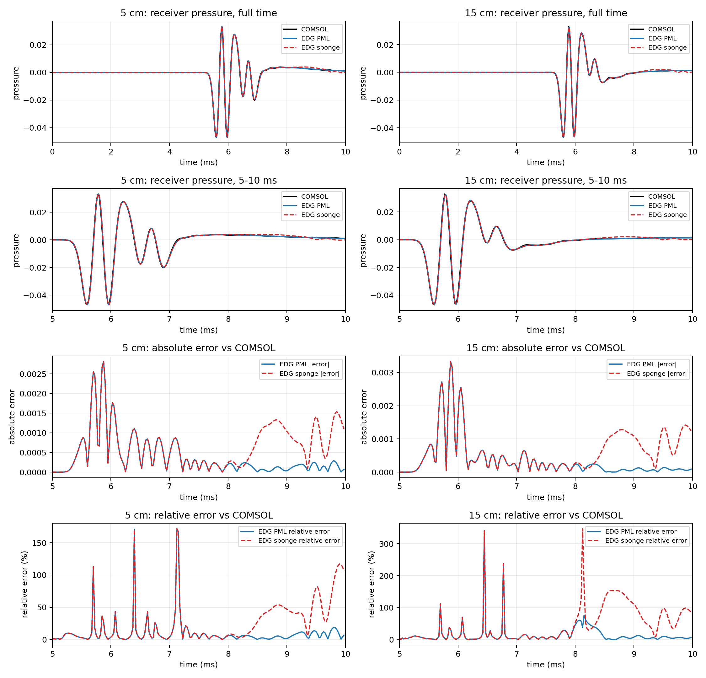
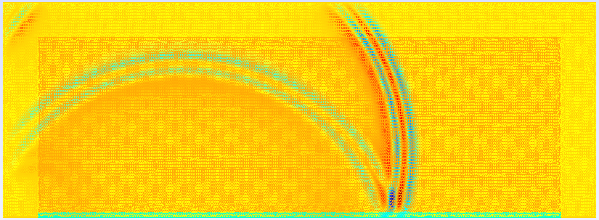
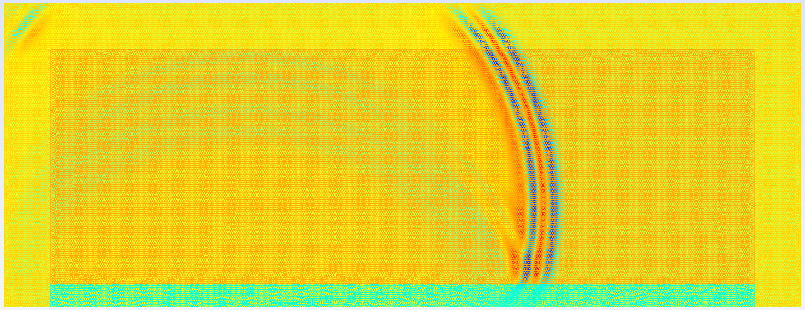
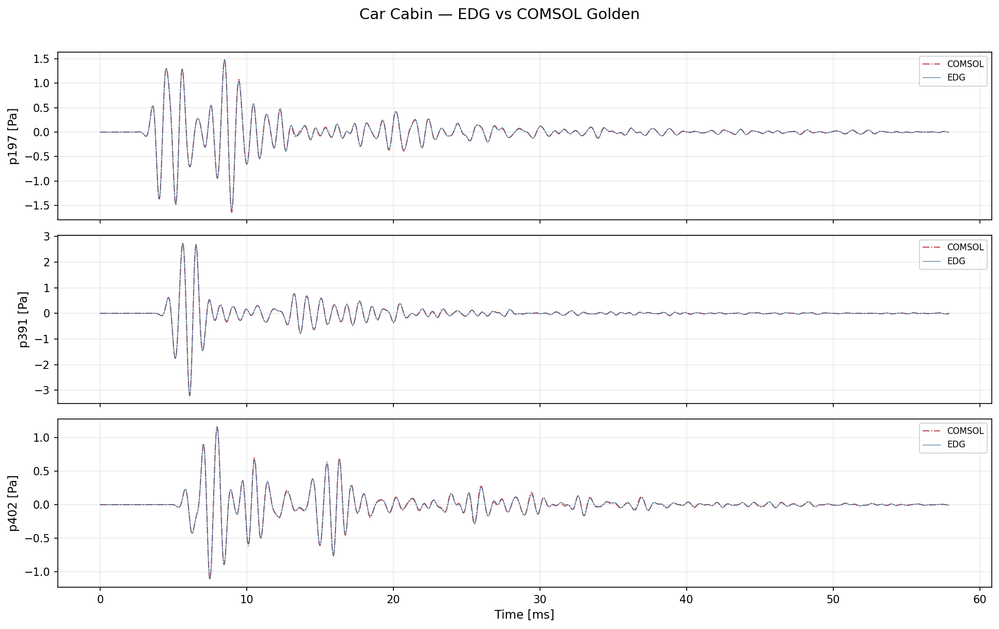

[**中文文档**](README.md) | [English](README.en.md)

## 简介

DG_RoomAcoustics 是一个基于时域波动法的开源室内声学仿真软件包。该软件采用节点间断伽辽金（Discontinuous Galerkin, DG）方法对线性声学方程进行空间离散，并使用高阶显式 ADER（Arbitrary high-order DERivative）格式进行时间积分。DG_RoomAcoustics 在传统几何声学工具难以胜任的场景中表现优异，能够高精度地捕捉衍射、散射和模态效应等复杂波动现象。软件遵循面向对象编程范式，注重易用性和灵活性，使研究人员和工程师能够以高精度和高计算效率仿真各类室内声学问题。

通过 Triton/TileLang 定制 Kernel 和 CUDA Graph 等优化技术，软件支持在 NVIDIA GPU 及**国产沐曦（MetaX）C500 GPU** 上进行高效加速计算，相对 CPU 可实现最高约 95 倍的性能提升。

## 安装

通过 GitHub 仓库安装 DG_RoomAcoustics：

```console
git clone https://github.com/YinLiu-91/edg-acoustics.git
cd edg-acoustics
python3 -m pip install -e .
```

## 使用与文档

请参阅[在线文档](https://dg-roomacoustics.readthedocs.io/)以高效使用和开发 DG_RoomAcoustics。使用 DG_RoomAcoustics 时，可参考仓库 [examples](examples) 目录中提供的示例，这些示例涵盖了多种场景，帮助您理解如何将软件应用于特定需求。

## GPU 加速

DG_RoomAcoustics 支持通过 CUDA/类CUDA 进行 GPU 加速计算，在 NVIDIA GPU（如 V100 等）/沐曦C500 等国产GPU 上可实现显著的性能提升。通过 `EDG_ACOUSTICS_DEVICE` 环境变量可灵活切换计算设备：

```bash
# 自动检测（默认优先使用 CUDA）
export EDG_ACOUSTICS_DEVICE=auto

# 强制使用 CPU
export EDG_ACOUSTICS_DEVICE=cpu

# 强制使用 CUDA/类CUDA
export EDG_ACOUSTICS_DEVICE=cuda
```

此外，软件已适配**国产沐曦（MetaX）C500 GPU**，通过 MACA 兼容层实现对国产硬件平台的完整支持。针对该架构的特性，我们定制了 TileLang FP64 GEMM 算子以充分利用其计算能力。

## GPU 加速性能对比

以下数据来源于 `scenario1` 标准测试算例，在 Intel CPU（8 线程）与 国产 GPU 上的对比。

### CPU vs GPU 时域求解性能

| 网格规模 | 四面体数量 | CPU（8 线程）ms/步 | CUDA + Graph ms/步 | 加速比 |
|---------:|-----------:|-------------------:|--------------------:|------:|
| 粗网格 (`coarser`) | 305 | 5.22 | 0.22 | **23.5x** |
| 细网格 (`lc0p20`) | 45,285 | 694.90 | 7.33 | **94.8x** |

### 求解器热点优化演进

| 优化阶段 | ms/步 | 相对初始基线 |
|---------|------:|------------:|
| 初始 PyTorch 基线 | 12.34 | 1.00x |
| 早期优化（CUDA Graph 前） | 8.41 | 1.47x |
| CUDA Graph 捕获 | 2.97 | 4.16x |
| CUDA Graph + Triton 融合 Kernel | 0.34 | **36.0x** |

### TileLang Kernel 在沐曦 C500 上的加速（相对 `torch.mm`）

| Kernel | 矩阵形状 | TFLOPS | 相对 torch.mm 加速比 |
|--------|---------|-------:|---------------------:|
| TileLang Lift GEMM | 35×60 × 60×N | 2.09 | **2.26x** |
| TileLang Derivative GEMM | 105×35 × 35×N | 2.46 | **1.39x** |


### Triton Kernel

使用 [Triton](https://triton-lang.org/) 编写定制 GPU Kernel，替代纯 PyTorch 操作以减少 Kernel 启动开销和内存带宽消耗：

- **`volume_surface_rhs_kernel`**：融合体积 RHS 组装，单次遍历计算全部 4 个打包 RHS 分量
- **`compact_interior_flux_kernel`**：融合面数据收集、跳跃量和迎风通量计算，将 13 个预计算系数数组压缩为 3 个法向分量 + 2 个标量（`rho0`、`c0`），大幅减少全局内存读取
- **`boundary_ri_flux_kernel`** / **`boundary_rp_flux_kernel`** / **`boundary_rp_cp_flux_kernel`**：针对反射系数 (RI)、有理极点 (RP) 和复共轭极点 (CP) 边界条件的专用融合 Kernel，支持边界 ADE 状态更新

### TileLang Kernel

使用 [TileLang](https://github.com/tilelang-ai/tilelang) 为 DG 求解器中特定形状的 FP64 矩阵乘法编写定制 GEMM Kernel，针对沐曦 C500 GPU 架构（warp=64、共享内存 64 KiB）优化：

- **TileLang Lift GEMM**（`bm48_bn64_bk16`）：加速 Lift 矩阵乘法（形状 35×60 × 60×N），使用全列 warp 策略和 swizzle 技术减少共享内存 bank 冲突，相对 `torch.mm` 加速 **2.26 倍**
- **TileLang Derivative GEMM**（`bm128_bn64_bk4`）：加速合并导数矩阵乘法（形状 105×35 × 35×N），利用 C500 大寄存器文件特性，相对 `torch.mm` 加速 **1.39 倍**

### 其他优化技术

| 优化技术 | 说明 | 效果 |
|---------|------|------|
| **CUDA Graph** | 将完整时间步捕获为 CUDA Graph 并重放，消除每步数十次 Kernel 启动的 CPU 延迟 | 消除 CPU 调度开销 |
| **紧凑通量系数** | 直接从法向量 `(nx, ny, nz)` 推导声学通量，替代 13 个预计算系数数组 | 显著减少内存读取 |
| **合并导数** | 将 `Dr`、`Ds`、`Dt` 分别与 `Q` 相乘改为单个 `[105,35] @ [35,N]` 的 tall DGEMM | 减少 Kernel 启动次数 |
| **融合状态累加** | 将 RHS 写入与 Taylor 累加融合在 Kernel 内完成，消除额外显存读写 | 节省一次内存往返 |
| **AoS 状态布局** | 将 `[Np, 4, N_tets]` 的 SoA 布局转为 `[Np, N_tets, 4]`，使同一节点的 4 个物理量在内存中连续 | 提升缓存命中率和向量化加载 |
| **仿射度量优化** | 利用直边四面体的常 Jacobian 特性，将度量张量从 `[3,3,Np,N_tets]` 压缩为 `[3,3,N_tets]` | 减少 Np（如 35 倍）的度量数据读取 |

这些优化技术的综合效果使求解器在 GPU 上的时间步进性能远超朴素的 PyTorch 实现，并充分发挥了 NVIDIA 和国产沐曦 GPU 的计算潜力。

## 算例介绍

### 二维多孔吸声层时域仿真

本算例复现 COMSOL Multiphysics 6.4 官方教程 `porous_absorber_time_domain`，使用二维间断伽辽金有限元（DG-FEM）方法模拟空气波导中底部多孔吸声材料对声脉冲的反射和吸收过程。算例目录位于 [`examples/dgfem_acoustic_2d/porous_absorber_time_domain`](examples/dgfem_acoustic_2d/porous_absorber_time_domain)。

**物理模型**：多孔材料（三聚氰胺泡沫）采用 Johnson-Champoux-Allard (JCA) 五参数模型描述其频率相关的等效密度和等效压缩率，通过矢量拟合（vectfit3，8 极点）将频域特性转换为时域辅助微分方程（ADE），实现扩展反应（ER）建模。声源为高斯导数型压力脉冲（Ricker 子波），接收点记录时域声压历史，总仿真时长 10 ms。

**关键技术**：
- 二维 DG-FEM，三角形非结构网格（约 12.6 万单元），多项式阶数 N=4
- 空气-多孔材料交界面采用迎风 Riemann 通量，基于两侧阻抗差异计算反射和透射
- 外圈采用完美匹配层（PML），对比传统海绵层（Sponge）在尾部精度的优势
- 对比 5 cm 和 15 cm 两种多孔层厚度工况

**与 COMSOL 验证结果**：DG-FEM 与 COMSOL 参考解全时域相对 L2 误差约 5–7%，PML 在尾部（8–10 ms）精度远优于 Sponge（PML 相对 L2 误差约 6–11%，Sponge 高达 37–86%）。



下图展示了 5 cm 和 15 cm 多孔层厚度工况下某一时刻的声压场分布云图，可以直观观察声波在多孔材料中的透射和衰减过程。

| 5 cm 多孔层 | 15 cm 多孔层 |
|:---:|:---:|
|  |  |

### 汽车车厢瞬态声学分析

本算例复现 COMSOL 6.3 教程示例 "Car Cabin Acoustics — Transient Analysis"，对汽车乘员舱内的三维瞬态声波传播进行时域仿真，并与 COMSOL 基准结果进行逐点验证。算例目录位于 [`examples/car_cabin_acoustics_transient_63_cleared`](examples/car_cabin_acoustics_transient_63_cleared)。

**物理模型**：三维汽车车厢声腔（空气密度 1.2 kg/m³，声速 343 m/s），左前高音扬声器表面施加高斯调制正弦法向速度激励（中心频率 1000 Hz）。声波在车厢内传播，与车窗、仪表板、车门、皮革座椅、地毯和车顶内衬等不同声学边界相互作用。

**网格与边界条件**：
- 推荐网格：从 COMSOL virtual geometry `mesh2` 导出，共 336,228 个四面体，44,448 个节点
- 9 个物理边界组，直接从 COMSOL `.mph` 文件中恢复：硬声学边界、恒阻抗边界（车窗/仪表板/车门）、有理逼近频率相关阻抗边界（座椅/地毯/车顶）、法向速度源
- 频率相关吸声材料通过矢量拟合（8–12 极点）转换为 EDG `AbsorbBC` 所需的反射系数有理逼近

**验证方法**：在车厢内设置 3 个麦克风接收点（坐标与 COMSOL "Microphone Response" 结果组对齐），将 EDG 结果插值到 COMSOL golden 时间序列上，计算每个点和全局的 RMS、最大绝对误差和相对 L2 误差。



## 许可证信息

本项目采用 GNU General Public License v3.0 许可协议。详情请参见 [LICENSE](LICENSE) 文件。

## 贡献

我们欢迎为 DG_RoomAcoustics 做出贡献！如果您希望帮助改进项目，请参阅[贡献指南](CONTRIBUTING.md)。


## 致谢

DG_RoomAcoustics 使用了以下开源软件包/代码/工具包：

- **[GMSH](https://gmsh.info/)**：功能强大的网格生成工具，内置 CAD 引擎和后处理器。

- **[meshio](https://github.com/nschloe/meshio)**：多功能的网格文件输入/输出库。

- **[modepy](https://documen.tician.de/modepy/index.html)**：用于在单纯形上进行模态（多项式）基函数求值和积分的库。

- **[numpy](https://numpy.org/)**：强大的 Python 数值计算库。

- **[Vector Fitting](https://www.sintef.no/en/software/vector-fitting/)**：用于将有理函数拟合到频域数据的软件包。

我们感谢上述软件包的作者对开源社区所做的贡献。


## 鸣谢

本软件包最初基于 [edg-acoustics](https://github.com/Building-acoustics-TU-Eindhoven/edg-acoustics) ，后续由项目作者Fork并进行了修改与拓展。
