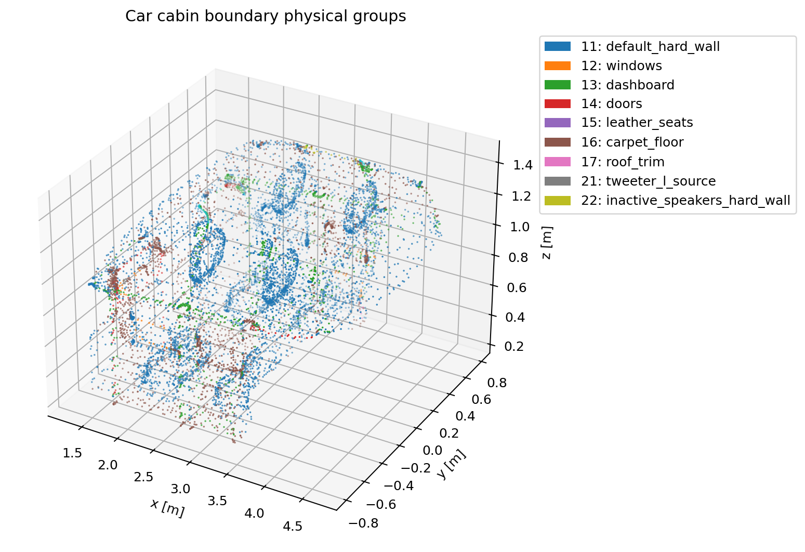

# Car cabin acoustics：COMSOL 边界组恢复与网格检查

这个目录用于把 COMSOL `Car Cabin Acoustics — Transient Analysis` 示例的几何和边界语义恢复到 Gmsh/EDG 可用的形式。原来的 `.geo` 只把所有边界写成一个 `Physical Surface(11)`，无法复现 COMSOL 中 seats、carpet、roof、windows、dashboard、doors、speaker source、default hard wall 等不同边界条件。

当前实现不依赖 COMSOL 打开 `.mph`。`.mph` 本质是 ZIP archive，边界 selections 和 pressure-acoustics features 可从内部 `dmodel.xml` 解析，已计算的参数值可从 `smodel.json` 读取。



## 已恢复的物理边界

`.geo` 现在使用 COMSOL `.mph` 中的 selection/entity id 定义多个 Gmsh physical surface。Gmsh 导入 STEP 后 surface tag 覆盖 `1..859`，其中 COMSOL selection 使用的 `1..454` 全部存在；额外的 `455..859` 归入 default hard wall。

| EDG/Gmsh label | 名称 | COMSOL 来源 | 当前处理 | surface 数 |
|---:|---|---|---|---:|
| 11 | `DefaultHardWall` | all imported STEP boundary surfaces minus active non-hard groups | sound hard wall | 509 |
| 12 | `Windows` | `sel2` / `Impedance 3 - Window` | constant impedance `Z_win` | 12 |
| 13 | `Dashboard` | `sel3` / `Impedance 1 - Dashboard` | constant impedance `Z_dash` | 85 |
| 14 | `Doors` | active physics feature `imp2` | constant impedance `Z_door` | 8 |
| 15 | `LeatherSeats` | `sel6` / `Impedance 4 - Seat` | rational approximation impedance | 226 |
| 16 | `CarpetFloor` | `sel4` / `Impedance 5 - Carpet` | rational approximation impedance | 1 |
| 17 | `RoofTrim` | `sel7` / `Impedance 6 - Roof` | rational approximation impedance | 6 |
| 21 | `TweeterLSource` | `sel12` / `Normal Velocity 1` | active normal velocity source `vn(t)` | 2 |
| 22 | `InactiveSpeakersHardWall` | `uni1 - sel12` | kept separate for diagnostics; should use hard-wall BC | 10 |

一个关键细节：COMSOL 的显示 selection `dif1` 叫 `Sound Hard Surfaces`，但它包含 surface `298, 302`；同时 active Door impedance feature `imp2` 也选择了 `298, 302`。求解复现应以 active physics feature 为准，所以本实现把 `298,302` 放入 `Doors`，不放入 default hard wall。

## 运行与检查

生成 `lc=0.20` mesh：

```bash
rtk gmsh -3 car_cabin_acoustics_transient_63_cleared.geo \
  -setnumber lc 0.20 \
  -format msh2 \
  -o car_cabin_acoustics_transient_63_cleared_lc0p20.msh
```

生成推荐的曲率加密 cleaned mesh：

```bash
rtk gmsh -3 car_cabin_acoustics_transient_63_cleared_curvature_refined.geo \
  -setnumber algo3d 10 \
  -setnumber lc_min 0.06 \
  -setnumber lc_max 0.12 \
  -setnumber curvature_refine 32 \
  -format msh2 \
  -o car_cabin_acoustics_transient_63_cleared_curv_hxt_lc0p12_min0p06.msh
```

其中 `car_cabin_acoustics_transient_63_cleared_curvature_refined.geo` 会 `Include` 基础 `.geo`，复用已恢复的 COMSOL physical groups，然后覆盖 Gmsh 网格尺寸选项：

- `lc_max=0.12`：光滑大面上的最大单元尺寸，比默认 `lc=0.20` 更密。
- `lc_min=0.06`：曲率变化较大区域允许加密到的最小尺寸；这里没有继续压到 `0.04`，因为 STEP 中存在极小特征，过小的全局最小尺寸会增加瘦长体单元风险。
- `curvature_refine=32`：打开 `Mesh.CharacteristicLengthFromCurvature`，让 Gmsh 根据 CAD 曲率自动缩小局部网格尺寸。
- `Mesh.CharacteristicLengthExtendFromBoundary=1`：把边界曲率尺寸向体网格内部传播，避免边界细、内部突然粗导致质量跳变。
- `algo3d=10`：使用 Gmsh HXT 3D mesher。对这个 STEP，Delaunay 路径可以生成可读 mesh，但会在极小/瘦长局部几何附近留下 ill-shaped tetrahedra warning；HXT 路径在不修改 CAD surface tag 和 physical groups 的前提下清掉了该 warning。

生成边界恢复和 mesh 诊断报告：

```bash
rtk python car_cabin_boundary_groups.py \
  --mesh car_cabin_acoustics_transient_63_cleared_lc0p20.msh \
  --json-out car_cabin_boundary_report.json
```

对推荐 HXT mesh 生成诊断报告：

```bash
rtk python car_cabin_boundary_groups.py \
  --mesh car_cabin_acoustics_transient_63_cleared_curv_hxt_lc0p12_min0p06.msh \
  --json-out car_cabin_boundary_report_hxt.json
```

生成边界组预览图：

```bash
rtk python car_cabin_boundary_groups.py \
  --mesh car_cabin_acoustics_transient_63_cleared_lc0p20.msh \
  --preview-out car_cabin_boundary_groups.png \
  --json-out car_cabin_boundary_report.json
```

运行 Gmsh 读入检查：

```bash
rtk gmsh -check car_cabin_acoustics_transient_63_cleared_lc0p20.msh -
rtk gmsh -check car_cabin_acoustics_transient_63_cleared_curv_hxt_lc0p12_min0p06.msh -
```

当前 `lc=0.20` mesh 的诊断结果：

| 项目 | 结果 |
|---|---:|
| STEP surfaces | 859 |
| boundary group coverage | 859 / 859，no missing，no duplicates |
| mesh points | 5009 |
| triangles | 9246 |
| tetrahedra | 15902 |
| bbox size | `[3.4434, 1.6075, 1.2190] m` |
| triangle physical tags | `11,12,13,14,15,16,17,21,22` |
| tetra physical tags | `1` |
| min triangle area | `2.995e-09` |
| min tetra volume | `5.131e-12` |
| min tetra edge length | `1.759e-05 m` |

`gmsh -check` 可以正常读入该 mesh，没有拓扑级读取错误。但生成时 Gmsh 仍报告：

- surface `859` 有 `4` 个 invalid surface elements；
- 优化后仍有 `31` 个 ill-shaped tetrahedra。

所以结论是：边界 physical group 已经恢复并可写入 mesh；但几何本身仍包含非常小/差质量局部特征，后续瞬态求解前应继续检查 surface `859` 附近的几何碎片或尝试 COMSOL 6.3 导出带 named selections 的清理后 mesh。

推荐曲率加密 HXT mesh `car_cabin_acoustics_transient_63_cleared_curv_hxt_lc0p12_min0p06.msh` 的诊断结果：

| 项目 | 结果 |
|---|---:|
| boundary group coverage | 859 / 859，no missing，no duplicates |
| mesh points | 17778 |
| triangles | 23966 |
| tetrahedra | 71245 |
| bbox size | `[3.4434, 1.6075, 1.2190] m` |
| triangle physical tags | `11,12,13,14,15,16,17,21,22` |
| tetra physical tags | `1` |
| min triangle area | `2.995e-09` |
| median triangle area | `7.460e-04` |
| min tetra volume | `1.426e-12` |
| median tetra volume | `4.253e-05` |
| min tetra edge length | `1.759e-05 m` |
| median tetra edge length | `7.733e-02 m` |

推荐 HXT mesh 的 `gmsh -check` 可正常读入，生成日志中不再出现 `invalid surface elements` 或 `ill-shaped tetrahedra` warning。作为对照，Delaunay 曲率加密候选 `algo3d=1, lc_min=0.04, lc_max=0.12, curvature_refine=32` 虽然边界组恢复正确，但优化后仍报告 `108` 个 ill-shaped tetrahedra，因此不再作为推荐网格。

这里的“清理”是网格生成策略层面的清理，不是破坏性 CAD topology 清理。定位结果显示最差单元集中在 STEP 中极小/瘦长局部特征附近，典型最小边长仍约为 `1.759e-05 m`，最小三角面面积约为 `2.995e-09 m^2`。曾测试 `Geometry.OCCFixSmallEdges/Faces` 等 OCC healing 选项；这些选项能改变导入阶段的几何修复行为，但在该 case 的 3D meshing 中触发了 `PLC Error` / `Invalid boundary mesh`，因此没有保留。为了保证几何和 COMSOL 边界语义正确，本目录当前不删除、不合并 STEP surface，而是保持：

- STEP 导入后的 boundary surface coverage 仍为 `859 / 859`，no missing，no duplicates；
- COMSOL 恢复出的 `Windows/Dashboard/Doors/LeatherSeats/CarpetFloor/RoofTrim/TweeterLSource` 等 Physical Surface label 不变；
- acoustic volume label `Physical Volume("AcousticAir", 1)` 不变；
- bbox 仍为 `[3.4434, 1.6075, 1.2190] m`，没有整体尺度或几何外形漂移；
- `gmsh -check` 对最终 HXT mesh 无读取错误。

如果后续必须真正移除 STEP 中的微小 CAD 特征，应优先在 COMSOL 6.3+ 或原始 CAD 工具中 defeature，然后重新导出带 named selections 的 geometry/mesh，并重新跑本目录的 boundary group 覆盖检查。直接在 Gmsh/OCC 中自动删小边/小面会带来 surface tag 改变、Physical Surface 分组失配、甚至无效边界网格的风险。

## 推荐求解网格：COMSOL virtual geometry mesh2

STEP->Gmsh 路径能恢复 physical groups，但该 STEP 仍含极小/瘦长局部几何。即使 HXT 不再报告 ill-shaped tets，EDG 使用的内切球尺度仍只有 `8.2307e-07 m`；在 `Nx=4, CFL=0.5, c0=343 m/s` 下，完整 `0.06 s` 约需 `4.50e8` 步，不适合作为默认瞬态复现网格。

因此当前推荐从 `.mph` 中直接运行 COMSOL 已清理的 virtual geometry `mesh2`，导出带几何 entity id 的 NASTRAN，再转换成 EDG/Gmsh mesh。命令如下：

```bash
rtk /usr/local/comsol64/multiphysics/bin/comsol compile ExportCarCabinMesh2.java

rtk /usr/local/comsol64/multiphysics/bin/comsol batch \
  -inputfile ExportCarCabinMesh2.class \
  car_cabin_acoustics_transient_63_cleared.mph \
  car_cabin_comsol_virtual_hmax0p114_hmin0p02.nas \
  -batchlog car_cabin_comsol_mesh2.log \
  -batchlogout \
  -nosave

rtk python convert_comsol_nastran_to_gmsh.py \
  --nastran car_cabin_comsol_virtual_hmax0p114_hmin0p02.nas \
  --output car_cabin_comsol_virtual_hmax0p114_hmin0p02.msh \
  --json-out car_cabin_comsol_virtual_report.json

rtk gmsh -check car_cabin_comsol_virtual_hmax0p114_hmin0p02.msh -
```

当前导出的 `car_cabin_comsol_virtual_hmax0p114_hmin0p02.msh` 诊断结果：

| 项目 | 结果 |
|---|---:|
| mesh source | COMSOL 6.4 打开 6.3 MPH，运行 `mesh2` |
| mesh points | 74448 |
| triangles | 70126 |
| tetrahedra | 336228 |
| bbox size | `[3.44338, 1.607507, 1.219] m` |
| triangle physical tags | `11,12,13,14,15,16,17,21,22` |
| tetra physical tags | `1` |
| min triangle area | `7.595e-06` |
| min tetra volume | `1.842e-08` |
| min tetra edge length | `2.729e-03 m` |
| min insphere diameter | `1.788e-03 m` |
| estimated EDG `dt` (`Nx=4,CFL=0.5`) | `2.896e-07 s` |
| estimated steps for `0.06 s` | `207196` |

这张 mesh 保留 MPH 中 active boundary entity 到 EDG physical label 的映射，同时避免 STEP 微小碎片把显式时间步长压到不可用范围。`main.py` 默认优先使用这张 mesh；如果文件不存在才回退到 STEP/HXT mesh，并用 `--max-steps` 做步数保护。

## 材料拟合与求解命令

三类频率相关边界来自 COMSOL admittance 表：

- `CarpetFloor` -> `carpet_admittance_63.txt` -> `carpet.mat`
- `RoofTrim` -> `roof_admittance_63.txt` -> `roof.mat`
- `LeatherSeats` -> `seat_admittance_63.txt` -> `seat.mat`

使用 vector fitting 生成 EDG `AbsorbBC` 的 `RI/RP/CP` 系数：

```bash
rtk octave -qf fit_car_cabin_admittance.m
```

当前拟合误差和 passivity 检查：

| material | pole count | RMS `|R_fit-R_target|` | max `|R|` |
|---|---:|---:|---:|
| seat | 12 | `6.9437e-02` | `1.000000` |
| carpet | 8 | `5.8947e-05` | `0.999184` |
| roof | 8 | `1.1537e-04` | `0.999151` |

运行 EDG case：

```bash
rtk env EDG_ACOUSTICS_DEVICE=cpu python main.py \
  --mesh car_cabin_comsol_virtual_hmax0p114_hmin0p02.msh \
  --total-time 0.06 \
  --output result.mat
```

CUDA 显存足够时可以使用默认 `EDG_ACOUSTICS_DEVICE=auto` 和 `--use-cuda-graph`。含 `normal_velocity` 源的边界会自动走通用 torch 边界通量路径，避免误用无源 RI/ADE 专用 kernel；CUDA graph 仍可捕获该路径，但 chunk size 固定为 `1`，使每步 replay 前能更新当前物理时间。

## 与 EDG 求解边界条件的关系

这些 physical labels 只是把 COMSOL 边界语义带入 mesh。完整复现 COMSOL 结果还需要把 COMSOL pressure-acoustics 边界条件转换成 EDG 当前求解方程使用的边界参数：

- label `11` 和 `22`：hard wall。
- label `12/13/14`：常数阻抗边界，可由 `R=(Z-rho0*c0)/(Z+rho0*c0)` 转为实反射系数：
  - windows: `R ~= 0.9974968672`
  - dashboard: `R ~= 0.9949874371`
  - doors: `R ~= 0.9949874371`
- label `15/16/17`：通过 `fit_car_cabin_admittance.m` 把 COMSOL admittance table 转为 EDG `AbsorbBC` 使用的反射系数 rational approximation。
- label `21`：COMSOL 的 active source 是 `Tweeter L` 上的 `Normal Velocity 1`，表达式为 `vn(t)`。EDG 当前使用同一类 Gaussian-modulated sine prescribed normal velocity，参数为 `f0=1000 Hz, delay=0.002 s, sigma=0.0005 s, amplitude=1`；其它 speaker surfaces 当前没有 active normal velocity feature，作为 hard-wall/diagnostic group `22` 保留。

本地 COMSOL 是 `/usr/local/comsol64/multiphysics/bin/comsol`，版本 `6.4.0.293`；`.mph` 的 last computation version 是 COMSOL 6.3。当前可以打开并运行 `mesh2`，但仍不要把 STEP surface tag 猜测当作边界语义来源，边界组仍以 `.mph` 中的 XML/JSON physics feature 为准。

## 通用复现流程与可复用 skill

本目录保留 car-cabin 的具体 worked example：边界组恢复、STEP/Gmsh 与 COMSOL virtual mesh 对比、材料拟合误差、EDG 运行命令都记录在上文。后续其它 COMSOL 声学 case 不应直接复制本 case 的 label 或脚本参数，而应按仓库文档重新恢复 `.mph` 中的 active physics、selections、参数、资源、source、receiver 和 study time。

通用流程已经整理到 [COMSOL 声学 case 到 EDG 的复现流程](../../docs/comsol_case_reproduction_workflow.md)。该文档覆盖：

- 如何从 `.mph` 的 `dmodel.xml`、`smodel.json`、`resources/*` 恢复边界语义和参数。
- 何时使用 STEP/OCC/Gmsh，何时改用 COMSOL virtual/defeatured mesh 导出。
- 如何用显式 JSON mapping 把 COMSOL/NASTRAN entity ref 转成 Gmsh physical labels。
- 如何把 admittance/impedance 表拟合为 EDG `RI/RP/CP` `.mat`。
- 如何组织 `main.py`、运行 smoke/full case，并给出和 COMSOL 的误差说明。

本机还安装了对应 Codex skill：`/home/liu/.codex/skills/comsol-step-gmsh-repro`。后续可以直接要求：

```text
使用 $comsol-step-gmsh-repro 复现这个 COMSOL .mph/.step 声学 case，并生成 EDG mesh、material fit、main.py 和对比报告。
```
