# Time-domain impedance boundary condition modeling with the discontinuous Galerkin method for room acoustics simulations

Huiqing Wang, and Maarten Hornikx

Citation: The Journal of the Acoustical Society of America 147, 2534 (2020); doi: 10.1121/10.0001128

View online: https://doi.org/10.1121/10.0001128

View Table of Contents: https://asa.scitation.org/toc/jas/147/4

Published by the Acoustical Society of America

## ARTICLES YOU MAY BE INTERESTED IN

Wind turbine audibility and noise annoyance in a national U.S. survey: Individual perception and influencing factors

The Journal of the Acoustical Society of America 146, 1124 (2019); https://doi.org/10.1121/1.5121309

Determination of propagation model matrix in generalized cross-correlation based inverse model for broadband acoustic source localization

The Journal of the Acoustical Society of America 147, 2098 (2020); https://doi.org/10.1121/10.0000973

A comparison of compressive equivalent source methods for distributed sources

The Journal of the Acoustical Society of America 147, 2211 (2020); https://doi.org/10.1121/10.0001073

On the three-dimensional sound fields from a moving monopole source above a non-locally reacting ground

The Journal of the Acoustical Society of America 147, 2581 (2020); https://doi.org/10.1121/10.0001086

Effects of vowel coproduction on the timecourse of tone recognition

The Journal of the Acoustical Society of America 147, 2511 (2020); https://doi.org/10.1121/10.0001103

Sound transmission loss of porous materials in ducts with embedded periodic scatterers

The Journal of the Acoustical Society of America 147, 978 (2020); https://doi.org/10.1121/10.0000650

# Time-domain impedance boundary condition modeling with the discontinuous Galerkin method for room acoustics simulations

Huiqing Wanga) and Maarten Hornikxb)

Building Physics and Services, Department of the Built Environment, Eindhoven University of Technology, P.O. Box 513,

5600 MB Eindhoven, The Netherlands

## ABSTRACT:

The time-domain nodal discontinuous Galerkin (TD-DG) method is emerging as a potential wave-based method for three-dimensional (3D) room acoustics modeling, where high-order accuracy in the low frequency range, geometrical flexibility, and accurate modeling of boundary conditions are of critical importance. This paper presents a formulation of broadband time-domain impedance boundary conditions (TDIBCs) of locally-reacting surfaces in the framework of the TD-DG method. The formulation is based on the approximation of the plane-wave reflection coefficient at normal incidence in the frequency domain using a sum of template rational functions, which can be directly transformed to the time-domain. The coupling of the TDIBCs with the discontinuous Galerkin discretization is achieved through the characteristic waves of the upwind flux along the boundary, where a series of first-order auxiliary differential equations is time-integrated in a high-order way. To verify the performance of the formulation, various numerical tests of single reflection scenarios are shown to demonstrate the cost efficiency and memoryefficiency of high-order basis functions, among which a 3D application to an impedance boundary of rigidly backed glass-wool baffle for room acoustic purposes is presented. VC 2020 Acoustical Society of America.

https://doi.org/10.1121/10.0001128

(Received 31 August 2019; revised 2 April 2020; accepted 3 April 2020; published online 23 April 2020)

[Editor: Lauri Savioja]

Pages: 2534–2546

## I. INTRODUCTION

Sound propagation in a room is a complicated process due to the geometry of the room and the objects inside it. Furthermore, a variety of surface natures and surface impedances, which are typically frequency-dependent, make it extremely hard to achieve analytical representations of the acoustic field. Therefore, computer simulation of the sound field in indoor environments has become a common tool for the analysis of sound in rooms.

In general, room acoustic modeling techniques can be divided into two categories, namely, geometrical acoustics methods and wave-based methods. Thanks to the steady increase in computing power, wave-based methods have become more mature during the past decades.2 Compared to frequency-domain wave-based methods, time-domain modeling allows single run broadband calculations with moving sources and time-varying domains and generates directly the impulse response of the room. After applications to fields as aeroacoustics,3 the time-domain discontinuous Galerkin (TD-DG) method has for the first time been evaluated as a potential wave-based method for room acoustics modeling purposes.4 Its high accuracy and ability to handle complex boundary geometries were demonstrated through verifications by analytical solutions and by comparison against measurement results of a real room. Since the acoustic wave equation is solved element-wise, highly efficient parallel-computing solvers that exploit modern hardware have been developed.5,6 The applicability of the discontinuous Galerkin (DG) solver to a large scale room acoustics simulation is demonstrated in Ref. 7, in analogy to the example of a cathedral-like geometry presented in Ref. 8. However, in order to provide physical simulation results that match real materials, a time-domain impedance boundary condition (TDIBC) formulation that handles frequency-dependent acoustic properties is needed.

The acoustic behavior of a locally reactive reflecting surface can be characterized by the surface impedance,9 the admittance,10–12 or the plane-wave reflection coefficient.13–16

Although these quantities are mathematically equivalent, the implementations of their respective TDIBC models differ at a discrete level. Furthermore, for time-domain computations, the impedance models defined in the frequency domain should satisfy the causality, reality, and passivity conditions in order to be physically admissible.9,17,18 One approach to incorporate the frequency-dependency is to model the impedance boundary based on the mass-spring-damper system.10,11,19–22 Besides, approaches based on well-chosen basis functions or digital filters in the frequency domain have been developed. Zhong et al.12 proposed to transform the frequency domain transfer function of the impedance model in the form of rational polynomials to an equivalent timedomain representation using the state-space canonical form. Approaches based on digital filter design have been proposed in Refs. 23 and 24. Another popular family of impedance models is the so-called multi-pole model,10,13,14,16,25–28 which offers great flexibility for fitting impedance values while ensuring physical admissibility conditions.

The aforementioned various TDIBC formulations and the corresponding stability analysis are usually tailored to the specific discretization methods that are used to simulate acoustic wave propagation. For example, a formulation based on the admittance in the framework of the finite volume method and its fully-discrete stability analysis using the trapezoid rule approximation to the time derivative is presented in Ref. 29. For the TD-DG method, an early attempt to implement the impedance boundary condition was made by Reymen et al., 10 where the three-parameter impedance model20 was reformulated in the form of a complex conjugate pole. The normal velocity on the impedance boundary was updated based on the convolution of the pressure from previous time steps with the impulse response of the admittance and the convolution is calculated in a piecewise-linear recursive way. Recently, two formulations based on the reflection coefficient instead of the impedance or admittance were proposed in Ref. 30 and Ref. 4 at the same time. Compared to the TDIBC formulations based on either the impedance or the admittance, the formulation using the reflection coefficient is computationally desirable as it is capable of handling singular cases of both the hard-wall and pressure-release boundaries without the need for exceptional treatments, where the impedance and the admittance value approaches infinity, respectively. Reference 4 adopts the upwind flux based on the characteristics of the hyperbolic law throughout the whole computational domain while Ref. 30 uses the centered flux along the impedance boundary and the upwind flux on the interior of the domain. From the analysis of disper-However, it could exhibit unphysical waves. Compared to the upwind flux, it is less accurate in terms of the dispersion error, which is of vital importance for the room acoustic auralization applications as shown by Saarelma et al.34

The main objective of this work is to develop a robust, efficient and generic TDIBC for locally-reacting materials, aiming at a further step towards a fully-fledged TD-DG solver for realistic room acoustic simulations. The formulation of the numerical flux along the impedance boundary is derived straightforwardly based on the plane-wave reflection coefficient and the characteristic acoustic waves, and its detailed implementations in the DG method are presented. The extension of previous frequency-independent impedance boundary formulation4 to the frequency-dependent one is achieved through the multi-pole representation of the reflection coefficient in the frequency domain. The fitting of parameters of this representation for an empirical impedance model or measurement data is achieved by solving an optimization problem. Combined with the auxiliary differential equations (ADE) method, the whole computation can be performed in a low-storage and high-order accuracy manner. To validate this formulation, numerical simulations of a single reflection scenario are performed. The convergence rates are verified and the benefits of using the high-order polynomial basis are highlighted. Both the amplitude and the phase error from the reflection, which are important for room acoustics modeling featuring multiple reflections, are investigated and quantified for both the plane-wave reflection in a one-dimensional (1D) setting and the spherical-wave reflection in a three-dimensional (3D) case. Application to a typical impedance model of a rigid-frame porous material for room acoustic uses is used to demonstrate the feasibility of the proposed approach.

The paper is organized as follows. The formulations of impedance boundary conditions within the TD-DG method are presented in Sec. II. Section III discusses and quantifies the accuracy of the implemented formulation by comparison with analytical solutions. Finally, the conclusions and outlook can be found in Sec. IV.

## II. TDIBC IN DG METHOD

## A. Governing equations and spatial discretization

In this work, the governing equations are the linear acoustic equations for a motionless propagation medium

$$
\frac {\partial \boldsymbol {v}}{\partial t} + \frac {1}{\rho} \nabla p = \boldsymbol {0},
$$

$$
\frac {\partial p}{\partial t} + \rho c ^ {2} \nabla \cdot \boldsymbol {v} = 0, \tag {1}
$$

where $\pmb { v } = [ u , v , w ] ^ { T }$ is the particle velocity vector, $p$ is the sound pressure, $\rho$ is the constant density of air, and c is the constant speed of sound. Equivalently, Eq. (1) reads

$$
\frac {\partial \boldsymbol {q}}{\partial t} + \nabla \cdot \boldsymbol {F} (\boldsymbol {q}) = \frac {\partial \boldsymbol {q}}{\partial t} + \boldsymbol {A} _ {j} \frac {\partial \boldsymbol {q}}{\partial x _ {j}} = 0, \tag {2}
$$

where $\pmb q ( \pmb x , t ) = [ u , v , w , p ] ^ { \mathrm { T } }$ is the acoustic variable vector and $A _ { j }$ is the constant flux Jacobian matrix with coordinate index $j \in [ x , y , z ]$ . Let $D ^ { k }$ be a set of simplex and geometrically conformal elements that discretize the computational domain $\Omega _ { h } , i . e . , \Omega _ { h } = \cup _ { k = 1 } ^ { K } D ^ { k }$ . The local solution $\pmb q _ { h } ^ { k } ( { \pmb x } , t )$ in element $D ^ { k }$ , where subscript h denotes the numerical approximation, is given by

$$
\boldsymbol {q} _ {h} ^ {k} (\boldsymbol {x}, t) = \sum_ {i = 1} ^ {N _ {p}} \boldsymbol {q} _ {h} ^ {k} (\boldsymbol {x} _ {i} ^ {k}, t) l _ {i} ^ {k} (\boldsymbol {x}), \tag {3}
$$

where $\pmb { q } _ { h } ^ { k } ( \pmb { x } _ { i } ^ { k } , t )$ are the unknown nodal values, $l _ { i } ^ { k } ( \pmb { x } _ { i } ^ { k } )$ is the multi-dimensional Lagrange polynomial basis of order $N ,$ which satisfies $l _ { i } ^ { k } ( \pmb { x } _ { i } ^ { k } ) = \delta _ { i j }$ , and indices $i , j$ denote the ordering of nodes. $N _ { p }$ is the number of local basis functions (or nodes) inside a single element and equal to $( N + d ) ! / ( N ! d ! )$ for simplex elements, where d is the dimensionality. The basis (shape) function $l _ { i } ^ { k } ( { \pmb x } )$ is determined by the nodal distribution $\boldsymbol { x } _ { i } ^ { k }$ , and in this study, the Legendre-Gauss-Lobatto (LGL) quadrature points are used for 1D problems and the a-optimized nodes distribution35 is used for 3D tetrahedron elements due to its low Lebesque constants. After the Galerkin projection and integration by parts twice, the semidiscrete nodal DG formulation of Eq. (2) reads,

$$
\int_ {D ^ {k}} \left(\frac {\partial \boldsymbol {q} _ {h} ^ {k}}{\partial t} + \nabla \cdot \boldsymbol {F} _ {h} ^ {k} (\boldsymbol {q} _ {h} ^ {k})\right) l _ {i} ^ {k} \mathrm{d} \boldsymbol {x} = \int_ {\partial D ^ {k}} \boldsymbol {n} \cdot (\boldsymbol {F} _ {h} ^ {k} (\boldsymbol {q} _ {h} ^ {k}) - \boldsymbol {F} ^ {*}) l _ {i} ^ {k} \mathrm{d} \boldsymbol {x}, \tag {4}
$$

where $\pmb { n } = [ n _ { x } , n _ { y } , n _ { z } ]$ is the outward normal vector of the element surface $\partial D ^ { k } , F ^ { * }$ , the so-called numerical flux across element intersection $\partial D ^ { k }$ , is a function of both the solution value from the interior side of the intersection, i.e., $\pmb q _ { h } ^ { - }$ and the exterior value $\pmb q _ { h } ^ { + }$ . In this study, the upwind numerical flux is used throughout the whole domain because of its low dispersive and dissipation error.33,36 It is defined by considering the direction of the characteristic speed, i.e.,

$$
\boldsymbol {n} \cdot \boldsymbol {F} ^ {*} (\boldsymbol {q} _ {h} ^ {-}, \boldsymbol {q} _ {h} ^ {+}) = \boldsymbol {L} (\boldsymbol {\Lambda} ^ {+} \boldsymbol {L} ^ {- 1} \boldsymbol {q} _ {h} ^ {-} + \boldsymbol {\Lambda} ^ {-} \boldsymbol {L} ^ {- 1} \boldsymbol {q} _ {h} ^ {+}), \tag {5}
$$

where K is a diagonal matrix with diagonal entries $[ 0 , 0 , c , - c ] . ~ \mathbf { A } ^ { + }$ and K contain the positive and negative entries of K, respectively. L is the eigenmatrix of the normally projected flux Jacobian, i.e.,

$$
\begin{array}{l} \boldsymbol {A} _ {n} = (n _ {x} \boldsymbol {A} _ {x} + n _ {y} \boldsymbol {A} _ {y} + n _ {z} \boldsymbol {A} _ {z}) \\ = L \Lambda L ^ {- 1}. \tag {6} \\ \end{array}
$$

Physically, $\Lambda ^ { + } \left( \Lambda ^ { - } \right)$ , respectively) corresponds to the characteristic waves propagating along (opposite to respectively) the outward normal direction n, which is referred to as outgoing waves out of $D _ { k }$ (incoming waves into $D _ { k } ,$ respectively). Therefore, the outgoing waves are associated with the interior solution $\pmb q _ { h } ^ { - }$ , whereas the incoming waves are dependent on the exterior (neighboring) solution $\pmb q _ { h } ^ { + }$ . Finally, the semidiscrete formulation is obtained by substituting the nodal basis expansion Eq. (3) and the upwind flux Eq. (5) into the strong formulation Eq. (4). The resulting vector-matrix form of the formulation and more descriptions of implementations can be found in Ref. 4.

It is well known that generally, the rate of convergence of the DG scheme in terms of the global $L ^ { 2 }$ error is $h ^ { N + \bar { 1 } / 2 }$ (h being the element size).37 When solving initial value problems such as calculating the room impulse response considered here, the dominant error comes from the spatial representations of the initial conditions, while the additional dispersive and dissipative errors from the wave propagation are relatively small and only visible after a very long time integration.31 When the upwind flux is used, the dissipation $\left( \kappa h \right) ^ { 2 N + \frac { 1 } { 2 } }$ order ðjhÞ2Nþ3 ,33,36 $\left( \kappa h \right) ^ { 2 N + 3 } , { 3 3 } , \dot { 3 } 6$ where j is the wavenumber. It should be noted that the audibility of the numerical error on the perceptual level is important for practical room acoustic simulations. Future studies are needed to investigate the modeling requirements and error constraints of the TD-DG scheme for the auralization purposes.

## B. Numerical flux formulation of TDIBC

Previously, a frequency-independent impedance boundary formulation was proposed to simulate a locally-reacting surface within the DG method and its semi-discrete stability was proved using the energy method.4 The essential idea is to reformulate the numerical flux along the normal direction to the impedance boundary surface by utilizing the characteristic waves of the linear acoustic equations and the reflection coefficient R. The incoming and outgoing characteristic acoustic waves, which are denoted as $\varpi _ { n } ^ { i n }$ and $\varpi _ { n } ^ { o u t }$ , and oriented in the opposite and the same direction of the outward normal n along the boundary surface, respectively, are defined as

$$
\varpi_ {n} ^ {i n} (\omega) = \frac {p (\omega)}{\rho c} - v _ {n} (\omega), \tag {7}
$$

$$
\varpi_ {n} ^ {o u t} (\omega) = \frac {p (\omega)}{\rho c} + v _ {n} (\omega), \tag {8}
$$

where $v _ { n } ( \omega ) = \pmb { v } ( \omega )$ - n denotes the particle velocity component normal to the surface at a given angular frequency x. Let $Z _ { s }$ denote the normalized surface impedance, i.e.,

$$
Z _ {s} (\omega) = \frac {1}{\rho c} \frac {p (\omega)}{v _ {n} (\omega)}, \tag {9}
$$

and the plane-wave reflection coefficient $R ( \omega )$ at normal incidence angle satisfies1

$$
R (\omega) = \frac {Z _ {s} (\omega) - 1}{Z _ {s} (\omega) + 1}. \tag {10}
$$

Inserting Eq. (9) into Eq. (10) directly yields the following condition concerning the reflection coefficient and characteristic waves

$$
R (\omega) = \frac {\varpi_ {n} ^ {i n} (\omega)}{\varpi_ {n} ^ {o u t} (\omega)}. \tag {11}
$$

The time-domain implementation of the impedance boundary condition is realized by coupling the above condition Eq. (11) with the DG discretization through the reformulation of the upwind flux near the boundaries. The use of the plane-wave reflection coefficient at normal incidence is consistent with the fact that the numerical flux from the nodal DG scheme is always normal to the boundary surface. Furthermore, the impedance surface is assumed to be locally reacting, which holds true when the sound speed in the reflecting material is much lower than that of the incident wave, especially for porous materials with a high flow resistivity.38 However, it should be noted that many common materials used in room acoustics such as solid panels and membranes are extendedly-reacting.

In this work, the real-valued frequency-independent reflection coefficient $R _ { \infty }$ is extended to the frequency-dependent one $R ( \omega )$ through the use of the multi-pole model. The whole TDIBC formulation consists of three steps. The first step is to transform the impedance values $Z _ { s } ( \omega )$ , which can be obtained from either a continuous semi-empirical impedance model or measured discrete impedance values, within the interested frequency range, to the corresponding normal reflection coefficient RðxÞ using Eq. (10). Second, the target reflection coefficient RðxÞ is approximated with a sum of rational functions 39

$$
\begin{array}{l} R (\omega) \approx R _ {\infty} + \sum_ {k = 1} ^ {S} \frac {A _ {k}}{\zeta_ {k} + \mathrm{i} \omega} \\ + \sum_ {l = 1} ^ {T} \frac {1}{2} \left(\frac {B _ {l} - \mathrm{i} C _ {l}}{\alpha_ {l} - \mathrm{i} \beta_ {l} + \mathrm{i} \omega} + \frac {B _ {l} + \mathrm{i} C _ {l}}{\alpha_ {l} + \mathrm{i} \beta_ {l} + \mathrm{i} \omega}\right) \\ = R _ {\infty} + \sum_ {k = 1} ^ {S} \frac {A _ {k}}{\zeta_ {k} + \mathrm{i} \omega} + \sum_ {l = 1} ^ {T} \frac {B _ {l} \mathrm{i} \omega + C _ {l} \beta_ {l} + \alpha_ {l} B _ {l}}{(\alpha_ {l} + \mathrm{i} \omega) ^ {2} + \beta_ {l} ^ {2}}, \tag {12} \\ \end{array}
$$

where $[ R _ { \infty } , A _ { k } , B _ { l } , C _ { l } , \zeta _ { k } , \alpha _ { l } , \beta _ { l } ] \in \mathbb { R }$ are all real numerical parameters. $R _ { \infty }$ is the limit value of $R ( \omega )$ as the frequency approaches infinity. $\zeta _ { k }$ and $\alpha _ { l } \pm \mathrm { i } \beta _ { l }$ are the real poles and complex conjugate pole pairs respectively. To satisfy the causality and reality conditions $\zeta _ { k } , \alpha _ { l } , \beta _ { l }$ need to be positive, and the passivity condition is fulfilled when $| R _ { n } ( \omega ) | \leq 1$ .16

By applying the inverse Fourier transform to Eq. (12), the so-called reflection impulse response function in the time-domain is obtained as

$$
\begin{array}{l} R (t) \approx R _ {\infty} \delta (t) + \sum_ {k = 1} ^ {S} A _ {k} \mathrm{e} ^ {- \zeta_ {k} t} H (t) \\ + \sum_ {l = 1} ^ {T} \mathrm{e} ^ {- \alpha_ {l} t} (B _ {l} \cos (\beta_ {l} t) + C _ {l} \sin (\beta_ {l} t)) H (t), \tag {13} \\ \end{array}
$$

where $\delta ( t )$ and $H ( t )$ are the Dirac delta and Heaviside function, respectively. As shown in Ref. 39, each term in R(t) can be interpreted as follows. The first term of Eq. (13) stands for the instantaneous response since $R _ { \infty }$ is the frequency independent value or high-frequency limit of $R ( \omega )$ . The second term is an exponentially decaying relaxation function, which mimics the absorption behavior of porous materials. The last group of terms is the so-called damped multi-oscillators that can be linked to resonator-type absorbers, where the imaginary part of the pole $\beta _ { l }$ determines the oscillation period and the real part $\alpha _ { l }$ governs the decaying rate.

The third and last step of the proposed TDIBC formulation is to enforce the multi-pole impedance model into the numerical flux along the impedance boundary surface. The time-domain counterpart of the characteristic acoustic waves as defined in Eqs. (7) and (8) can be obtained by premultiplying the acoustic variables q with the left eigenmatrix $L ^ { - 1 }$ , i.e.,

$$
\boldsymbol {L} ^ {- 1} \boldsymbol {q} = \left[ \begin{array}{c} 0 \\ 0 \\ \varpi_ {n} ^ {\text {out}} (t) \\ \varpi_ {n} ^ {\text {in}} (t) \end{array} \right] = \left[ \begin{array}{c} 0 \\ 0 \\ \frac {p (t)}{\rho c} + v _ {n} (t) \\ \frac {p (t)}{\rho c} - v _ {n} (t) \end{array} \right]. \tag {14}
$$

It should be noted that the first two characteristic terms in $\operatorname { E q } .$ . (14) are numerically irrelevant in the whole boundary formulation since their characteristic speeds (the first two diagonal values in K) are zero. Finally, the numerical flux formulation of the TDIBC reads

$$
\boldsymbol {n} \cdot \boldsymbol {F} ^ {*} (\boldsymbol {q} _ {h} ^ {-}) = \boldsymbol {L} \boldsymbol {\Lambda} \left[ 0, 0, \varpi_ {n} ^ {o u t} (t), \varpi_ {n} ^ {i n} (t) \right] ^ {\mathrm{T}}, \tag {15}
$$

where $\varpi _ { n } ^ { o u t } ( t )$ can be first calculated with the interior solution values at each of discrete nodes along the boundary as

$$
\varpi_ {n} ^ {o u t} (t) = \frac {p ^ {-} (t)}{\rho c} + v _ {n} ^ {-} (t), \tag {16}
$$

and then based on the condition of $\operatorname { E q . }$ (11), the timedomain incoming wave $\varpi _ { n } ^ { i n } ( t )$ is obtained from the convolution of $\varpi _ { n } ^ { o u t } ( t )$ with $R ( t )$ of Eq. (13),

$$
\varpi_ {n} ^ {i n} (t) = \int_ {- \infty} ^ {t} \varpi_ {n} ^ {o u t} (\tau) R (t - \tau) \mathrm{d} \tau . \tag {17}
$$

To compute the convolution Eq. (17), the ADE method39,40 is used. Substitution of the reflection impulse response $R ( t )$ $\operatorname { E q . }$ (13) into Eq. (17) yields

$$
\begin{array}{l} \varpi_ {n} ^ {i n} (t) = R _ {\infty} \varpi_ {n} ^ {o u t} (t) + \sum_ {k = 1} ^ {S} A _ {k} \phi_ {k} (t) \\ + \sum_ {l = 1} ^ {T} \Big [ B _ {l} \psi_ {l} ^ {(1)} (t) + C _ {l} \psi_ {l} ^ {(2)} (t) \Big ], \tag {18} \\ \end{array}
$$

where the so-called accumulators or auxiliary variables $\phi _ { k } ( t ) , \psi _ { l } ^ { ( 1 ) } ( t ) , \psi _ { l } ^ { ( 2 ) } ( t )$ , are given by

$$
\phi_ {k} (t) = \int_ {0} ^ {t} \varpi_ {n} ^ {o u t} (\tau) \mathrm{e} ^ {- \zeta_ {k} (t - \tau)} \mathrm{d} \tau , \tag {19a}
$$

$$
\psi_ {l} ^ {(1)} (t) = \int_ {0} ^ {t} \varpi_ {n} ^ {o u t} (\tau) \mathrm{e} ^ {- \alpha_ {l} (t - \tau)} \cos \left(\beta_ {l} (t - \tau)\right) \mathrm{d} \tau , \tag {19b}
$$

$$
\psi_ {l} ^ {(2)} (t) = \int_ {0} ^ {t} \varpi_ {n} ^ {o u t} (\tau) \mathrm{e} ^ {- \alpha_ {l} (t - \tau)} \sin \left(\beta_ {l} (t - \tau)\right) \mathrm{d} \tau . \tag {19c}
$$

The first term in Eq. (18) corresponds to the real-valued impedance boundary formulation. The bounds of the integrals in Eq. (19) are reduced to ½0; t due to the causality constraint indicated in the Heaviside function $H ( t )$ . The accumulators are calculated by solving the following first-order ordinary differential equations (ODEs) with zero initial values, which result from the differentiation of Eqs. (19) with respect to time

$$
\frac {\partial \phi_ {k}}{\partial t} + \zeta_ {k} \phi_ {k} (t) = \varpi_ {n} ^ {o u t} (t), \tag {20a}
$$

$$
\frac {\partial \psi_ {l} ^ {(1)}}{\partial t} + \alpha_ {l} \psi_ {l} ^ {(1)} (t) + \beta_ {l} \psi_ {l} ^ {(2)} (t) = \varpi_ {n} ^ {o u t} (t), \tag {20b}
$$

$$
\frac {\partial \psi_ {l} ^ {(2)}}{\partial t} + \alpha_ {l} \psi_ {l} ^ {(2)} (t) - \beta_ {l} \psi_ {l} ^ {(1)} (t) = 0. \tag {20c}
$$

As shown by Dragna et al., 39 the ADE method keeps the same order accuracy of a general multi-stage time integration scheme. Furthermore, since these accumulators only exist on the boundary nodes and only one time stage history of their values need to be stored, this approach has the benefit of low memory requirements.

## C. Discussions on time stepping and stability

In this work, the basic idea of method of lines (MOL) is followed. After the spatial discretization with the DG method, a five-stage, fourth-order explicit Runge-Kutta (RK) scheme41 is used to integrate all the time-derivatives of the discretized system. An explicit time-stepping method comes with the conditional stability, which necessitates an upper bound on the time step size Dt. From the classical stability analysis of the MOL,42,43 it is required that the time step size $\Delta t$ is small enough so that the product of $\Delta t$ with the full eigenvalue spectrum of the spatially-discretized system falls inside the stability region of the time integration scheme.42,43 However, for the proposed scheme, the spatial discretization with the DG method is no longer completely decoupled from the time integration. To be more specific, the spatially-dependent upwind flux along the impedance boundary involves the time-integrated auxiliary variables, which are in turn stated explicitly in terms of the spatial dependent variables as shown in Eqs. (18) and (20). As a result, the stability analysis for the coupled system as considered here is not as straightforward as the well-established von Neumann analysis, which is typically applied to an initial-valued system of ODEs as in Ref. 29. Instead of providing a solid proof of discrete stability, the preliminary stability analysis for coupled systems from Refs. 39 and 44 are adopted for reference. It was claimed that the maximum allowable time step is determined by two factors: (1) the usual Courant-Friedrichs-Lewy (CFL) condition for the spatial discretization with DG method, which requires that $\Delta t \le C _ { 1 } / m a x | \lambda _ { N } |$ , where $\lambda _ { N }$ represents the eigenvalues of the spatial discretization by DG method and $C _ { 1 }$ is a constant depending on the stability region of the time-stepping method; (2) the stiffness of the ADEs as shown in Eq. (20), which is influenced by the maximum possible value of the parameters $\zeta , \alpha , \beta$ in the multi-pole approximation. In this work, as will be presented in the following section, the stiffness is restricted so that the stability of the ADEs is automatically satisfied given a time-step size resulting from the first factor. For the first factor, it is known that for the linear system with first order of spatial differentiation, the gradients of the normalized Nth order polynomial basis are of order $\mathcal { O } ( N ^ { 2 } / h )$ near the boundary part of the element,31 consequently, the magnitude of the maximum eigenvalue $\lambda _ { N }$ scales with the polynomial order N as: max $\left( \lambda _ { N } \right) \propto N ^ { 2 }$ , indicating that $\Delta t \propto N ^ { - 2 }$ . This severe time step size restriction greatly limits the computational efficiency of high polynodetermined in the following way:31

$$
\Delta t = C _ {C F L} \cdot \min (\Delta x _ {l}) \cdot \frac {1}{c} \cdot \frac {1}{N ^ {2}}, \tag {21}
$$

where $\Delta x _ { l }$ is the smallest edge length of mesh elements and $C _ { C F L }$ is a constant of order Oð1Þ.

## D. Properties of rational functions and parameters identification

When fitting a generic broadband impedance model with Eq. (12), the fitted solutions are not unique. The three admissibility conditions need to be verified for each set of parameters as, otherwise, unphysical instabilities arise. Also, the additional computational work is proportional to the number of poles used. Furthermore, each term in the reflection impulse response $R ( t )$ may vary drastically even though the corresponding frequency domain model $R ( \omega )$ as a whole approximates the same impedance models or data equally well. Consequently, for the sake of numerical stability and computational efficiency, restrictions on the parameter values and number of poles are needed.

Each rational function with single real pole has two degrees of freedom (DoF). It is a monotonically decreasing function over frequency in terms of magnitude, which resembles a low-pass filter. At zero frequency, the maximum value is $A / \zeta$ obtained from Eq. (12) and the rate at which the magnitude decreases becomes smaller with increasing value of f.

The rational function with complex conjugate pole pair has four parameters (DoFs). Recall that the mass-springdamper three-parameter impedance model is expressed as

$$
Z _ {s} (\omega) = R _ {0} + X _ {1} \mathrm{i} \omega + \frac {X _ {- 1}}{\mathrm{i} \omega}, \tag {22}
$$

with the resistance $R _ { 0 } ,$ the stiffness $X _ { - 1 }$ , and the mass $X _ { 1 }$ being positive. Inserting above Eq. (22) into Eq. (10) yields

$$
R (\omega) = 1 - \frac {2 \mathrm{i} \omega / X _ {1}}{- \omega^ {2} + \frac {R _ {0} + 1}{X _ {1}} \mathrm{i} \omega + \frac {X _ {- 1}}{X _ {1}}}.\tag {23}
$$

By comparing Eq. (23) with the complex-pole rational function, it can be seen that they differ in the constant term 1, the sign of the complex part in the numerator, and the number of parameters. In an attempt to mimic the physical behavior of a mass-spring-damper system, we define $C \beta + B \alpha = 0 ,$ i.e., $C = - \alpha B / \beta .$ Consequently, the DoFs are reduced to three and the magnitude of each rational function $B \mathrm { i } \omega / ( - \omega ^ { 2 }$ $+ 2 { \alpha } \mathrm { i } \omega + \alpha ^ { 2 } + \beta ^ { 2 } )$ now increases from 0 at zero frequency to the maximum value of $B / 2 \alpha$ at the resonance frequency $\omega _ { 0 } = \sqrt { \alpha ^ { 2 } + \beta ^ { 2 } }$ , and then approaches 0 asymptotically.

To give an example of how to obtain the parameters of the multi-pole approximation for a specific impedance model, we consider a glass-wool baffle mounted on a rigid backing that is typical for room acoustic purposes. The surface impedance is modeled by the Johnson-Champoux-Allard-Lafarge (JCAL) model,45 which is a phenomenological model considering wave propagation in porous materials on a microscopic scale. The characteristic impedance $Z _ { c }$ reads $Z _ { c } = \sqrt { \rho _ { e f f } B _ { e f f } }$ , where the effective density $\rho _ { e f f }$ and the effective bulk modulus $B _ { e f f }$ are described by

$$
\rho_ {e f f} = \frac {\rho \alpha_ {\infty}}{\varphi} \left[ 1 + \frac {\sigma \varphi}{\mathrm{i} \omega \alpha_ {\infty} \rho} \left(1 + \frac {4 \mathrm{i} \alpha_ {\infty} ^ {2} \eta \rho}{\sigma^ {2} \Lambda^ {2} \varphi^ {2}}\right) ^ {1 / 2} \right], \tag {24}
$$

$$
B _ {e f f} = \frac {\gamma P _ {0}}{\varphi} \left(\gamma - \frac {\gamma - 1}{\left[ 1 + \frac {\varphi \eta}{\mathrm{i} \omega k _ {0} ^ {\prime} \rho P _ {r}} \left(1 + \frac {4 \mathrm{i} \omega k _ {0} ^ {\prime 2} \rho P _ {r}}{\eta \Lambda^ {\prime 2} \varphi^ {2}}\right) ^ {1 / 2} \right]}\right) ^ {- 1}. \tag {25}
$$

The descriptions of physical parameters and their values for a typical glass wool material measured from experiments46 are given in Table IV in the Appendix. The surface impedance of rigidly backed porous layer with thickness of d reads

$$
Z _ {s} = - \mathrm{i} Z _ {c} \cot (\kappa_ {\text {eff}} d), \tag {26}
$$

where the wavenumber of the porous material is given as $\kappa _ { e f f } = \omega \sqrt { \rho _ { e f f } / B _ { e f f } }$ . In this study, the parameters in the multi-pole fit are obtained by the optimization technique first presented by Cott-e et $a l . ^ { \overline { { 2 5 } } }$ It is shown25 that the optimization technique is capable of ensuring the positivity of the fitting parameters in order to meet the causality and reality conditions. Furthermore, the number of poles can be pre-defined and the maximum values of parameters can be confined such that the stiffness of ADEs falls below the threshold as determined by the discrete stability condition. However, different from the general impedance boundary formulations using admittance as described in Refs. 11 and 29, where the condition for passivity is framed in terms of the positivity of real-valued fitting coefficients of the impedance model, the passivity condition of the current impedance boundary formulation is fulfilled when $| R _ { n } ( \omega ) | \leq 1 . ^ { 1 6 }$ Consequently, a posterior check $| R _ { n } ( \omega ) |$ $\leq 1$ is needed.

For the JCAL model under consideration, it is sufficient to use real poles alone since the absorption coefficient increases monotonously with frequency. Since $R ( \omega )$ is a complex value, both the real parts and the imaginary parts should be fitted simultaneously instead of the amplitude and the phase in order to avoid wrap around ambiguity.11 The real-pole approximation can be rearranged to

$$
R (\omega) \approx \sum_ {k = 1} ^ {S} \frac {A _ {k}}{\zeta_ {k} + \mathrm{i} \omega} = \sum_ {k = 1} ^ {S} \frac {A _ {k} \zeta_ {k}}{\zeta_ {k} ^ {2} + \omega^ {2}} - \mathrm{i} \sum_ {k = 1} ^ {S} \frac {A _ {k} \omega}{\zeta_ {k} ^ {2} + \omega^ {2}}. \tag {27}
$$

Following the approach as in Ref. 25, the optimization is performed considering 100 frequencies logarithmically sampled between 20 and 1000 Hz, and the Euclidean norm of the deviation of real parts are minimized while keeping the difference of imaginary parts at each of the sampled frequency under a tolerance value -, i.e.,

TABLE I. Coefficients $A _ { k }$ and $\zeta _ { k }$ of the real pole approximation for the rigidly backed layer of JCAL model.

<table><tr><td>Coefficients</td><td> $A_{k}$ </td><td> $\zeta_{k}$ </td></tr><tr><td> $k = 1$ </td><td> $3.4454 \times 10^{2}$ </td><td> $1.2967 \times 10^{3}$ </td></tr><tr><td> $k = 2$ </td><td> $1.1999 \times 10^{4}$ </td><td> $4.3215 \times 10^{4}$ </td></tr><tr><td> $k = 3$ </td><td> $4.9999 \times 10^{4}$ </td><td> $2.8108 \times 10^{3}$ </td></tr><tr><td> $k = 4$ </td><td> $2.9954 \times 10^{3}$ </td><td> $1.4546 \times 10^{4}$ </td></tr><tr><td> $k = 5$ </td><td> $-4.9298 \times 10^{4}$ </td><td> $2.8111 \times 10^{3}$ </td></tr></table>

$$
\min _ {A _ {k}, \zeta_ {k}} \left(\sqrt {\sum_ {i = 1} ^ {1 0 0} \left| \operatorname{Re} [ R (\omega (i)) ] - \sum_ {k = 1} ^ {S} \frac {A _ {k} \zeta_ {k}}{\zeta_ {k} ^ {2} + \omega (i) ^ {2}} \right|}\right)
$$

$$
\text {such that} \left\{ \begin{array}{l} 0 \leq \zeta_ {k} \leq \zeta_ {\max} \\ \forall i, \quad \left| \operatorname{Im} [ R (\omega (i)) ] + \sum_ {k = 1} ^ {S} \frac {A _ {k} \omega (i)}{\zeta_ {k} ^ {2} + \omega (i) ^ {2}} \right| \leq \epsilon , \end{array} \right. \tag {28}
$$

where $\zeta _ { m a x }$ is the threshold value for $\zeta$ due to the discrete stability condition and is chosen as $5 \times 1 0 ^ { 4 }$ in this work considering the CFL condition and the interested frequency range up to 1000 Hz. To solve this minimization problem, the interior-point algorithm47 of the non-linear minimization is used. A series of optimizations is run to get a good fit. In the first run, the initial values of $A _ { k }$ and $\zeta _ { k }$ are chosen randomly between 0 and $\zeta _ { m a x }$ and a relatively large value of - is used, e.g., $\epsilon = 1 \times 1 0 ^ { - 1 }$ . Then, the obtained set of coefficients is used as the initial value for the next optimization with a smaller value of -. The process continues until a good approximation is obtained. Numerical experiments show that there is a compromise between the number of poles and the fitting accuracy. One set of coefficients is given in Table I, and the fitted reflection coefficient is plotted in Fig. 1. The maximum absolute value error at the sampled frequencies are $6 . 1 5 1 3 \times 1 0 ^ { - 4 }$ and $3 . 6 3 5 7 \times 1 0 ^ { - 5 }$ for the real and imaginary parts, respectively.

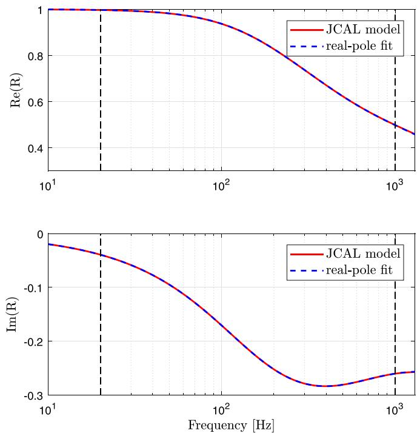  
FIG. 1. (Color online) Real and imaginary part of the normal reflection coefficient of rigidly backed layer of JCAL model (red solid line), real pole fitting with the set of coefficients in Table IV (dashed blue line) in frequency band 20–1000 Hz.

## III. NUMERICAL VERIFICATIONS

In this work, all the simulations are initiated with the same Gaussian-shaped pressure conditions

$$
p (\boldsymbol {x}, t = 0) = \mathrm{e} ^ {(- \ln 2 / b ^ {2}) (\boldsymbol {x} - \boldsymbol {x} _ {s}) ^ {2}}, \tag {29a}
$$

$$
\boldsymbol {v} (\boldsymbol {x}, t = 0) = \boldsymbol {0}, \tag {29b}
$$

where $x _ { s }$ represents the source coordinates and b the halfbandwidth of this Gaussian pulse. A smaller value of b indicates a source spectrum up to a higher frequency.

## A. Numerical properties and error in 1D

To verify the convergence property of the proposed formulation of the TDIBC and to quantify both the dissipation and dispersion error, a 1D single reflection scenario is considered. Each of the following experiment consists of two simulations. In the first simulation, the direct sound signal, denoted as $p _ { d } ( t )$ , is recorded. In the second simulation, a reflecting surface is present and the measured sound pressure signals contain both the direct sound and the sound reflected from the impedance surface. The reflected sound signal $p _ { r } ( t )$ can obtained by subtracting $p _ { d } ( t )$ . The spectra of the direct sound and the reflected sound, denoted as $P _ { d } ( f )$ and $P _ { r } ( f )$ , respectively, are obtained by Fourier transforming $p _ { d }$ and $p _ { r }$ without windowing. Let $R _ { 1 }$ denote the distance between the source and the receiver and $R _ { 2 }$ is the distance between the receiver and the image source mirrored by the reflecting impedance surface. The numerical plane-wave reflection coefficient $R _ { n u m }$ is calculated as follows:

$$
R _ {n u m} (f) = \frac {P _ {r} (f) \cdot G (\kappa R _ {1})}{P _ {d} (f) \cdot G (\kappa R _ {2})}, \tag {30}
$$

where $G ( \kappa R )$ is the 1D Green’s function for the free field propagation and j is the wavenumber. For room acoustic modeling, where multiple reflections happen inside an enclosure, it is important to quantify the error arising from each reflection. The dissipation error $\epsilon _ { a m p }$ in dB and the phase error $\epsilon _ { \vartheta }$ in % from a single reflection are calculated as follows:

$$
\epsilon_ {a m p} (f) = 2 0 \log_ {1 0} \left| \frac {R _ {a n a} (f)}{R _ {n u m} (f)} \right|, \tag {31a}
$$

$$
\epsilon_ {\vartheta} (f) = \frac {1}{\pi} \left| \vartheta \left(R _ {a n a} (f)\right) - \vartheta \left(R _ {n u m} (f)\right) \right| \times 100 \%, \tag {31b}
$$

where $R _ { a n a } ( f )$ is the analytical plane-wave reflection coefficient and $\vartheta ( \cdot )$ extracts the phase angle of a complex number. For a given broadband incident acoustic wave of arbitrary amplitude, the loss of sound pressure level (SPL) and the distortion of the phase across the frequency range of interest can be quantified.

Consider an 1D test case with an impedance boundary condition on the left $( x = 0 \mathrm { m } )$ and a non-reflecting boundary condition on the right $( x = 1 0 \mathrm { ~ m } )$ . The Gaussian pressure pulse is located $x _ { s } = 6 \mathrm { m }$ while the receiver location is at $x _ { r } = 3  { \mathrm { m } } .  { b }$ is chosen as 0.15 such that the pulse has a significant frequency content up to 1000 Hz. The simulation is run for a non-dimensional time of $\bar { t } = t / ( l _ { r e f } / c ) = 1 5$ , where t is physical time and $l _ { r e f } { = } 1 $ m is used as the reference length, to make sure that the rightward-traveling wave has left the domain while the reflected leftward-traveling wave has passed the receiver location to a sufficient extent. The realvalued, single real pole, and single complex conjugate pole cases are considered separately. Without loss of generality, the real-valued specific impedance is chosen as $Z _ { s } = 1 9$ , the real pole coefficients are chosen as $[ A , \zeta ] = [ 6 . 4 \times 1 0 ^ { 3 }$ ; $8 \times 1 0 ^ { 3 } \mathrm { ] }$ . The complex conjugate pole pair has coefficient $\left[ B , C , \alpha , \beta \right] = \left[ 1 . 3 1 9 5 \times 1 0 ^ { 3 } , - 7 . 6 1 7 9 \times 1 0 ^ { 2 } , 9 . 4 2 4 7 \times 1 0 ^ { 2 } \right]$ ; $1 . 6 3 2 4 \times 1 0 ^ { 3 } ]$ , which corresponds to a maximum value of reflection coefficient 0.7 at the resonance frequency 300 Hz.

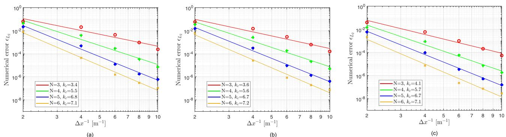  
FIG. 2. (Color online) Convergence rate test of - 2 with C ¼ 1 and N ¼ 3; 4; 5; 6: (a) real-valued impedance, (b) single real pole, (c) single complex conjugate pole.

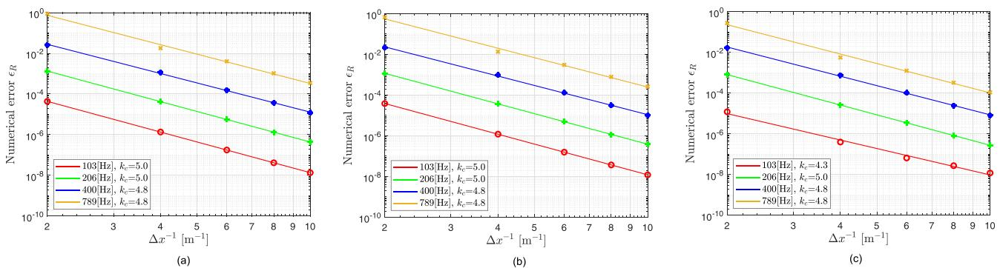  
FIG. 3. (Color online) Convergence rate test of $\epsilon _ { R } ( f )$ with $C _ { C F L } = 1$ . (a) Real-valued impedance, (b) single real pole, (c) single complex conjugate pole.

## 1. Convergence rate verification

The numerical errors originate from the spatial and temporal discretization of the interior domain, as well as from the impedance boundary formulation, where an extra recursive convolution error may be involved. Before quantifying the error magnitudes, first, the convergence rate, denoted by $k _ { c }$ with respect to the mesh sizes, is verified. The physical domain is discretized with ½20; 40; 60; 80; 100 uniform elements $( \Delta x = [ 0 . 5 , 0 . 2 5 , 0 . 1 6 7 , 0 . 1 2 5 , 0 . 1 ] ~ \mathrm { ~ m } )$ . Two error measures are used. The first one is the standard $L ^ { 2 }$ error defined as $\epsilon _ { L ^ { 2 } } = | | p _ { a n a } ( \bar { t } = 1 5 ) - p _ { n u m } ( \bar { t } = 1 5 ) | | _ { L ^ { 2 } }$ , where $p _ { a n a } ( \bar { t } = 1 5 )$ and $p _ { n u m } ( \bar { t } = 1 5 )$ denote the analytical solu-$\mathrm { t i o n } ^ { 4 9 }$ and the numerical solution at the final time across the whole domain. $| | \cdot | | _ { L ^ { 2 } }$ denotes the $L ^ { 2 }$ integration, which is carried out numerically and accurately up to the order of polynomial approximation. The second error measure is defined as the absolute-valued deviation of magnitude of the reflection coefficient at discrete sampling frequencies, i.e., $\epsilon _ { R } ( f ) = | R _ { a n a } ( f ) - R _ { n u m } ( f )$ j.

In practice, it is desirable to set $C _ { C F L }$ very close to the stability limit to save computational time. In order to get insights into the effects of the temporal errors on the convergence rate from both the time derivative approximation and the convolution, all test are performed using relatively large time steps that correspond to $C _ { C F L } = 1$ in Eq. (21) for each set of the polynomial basis order and the mesh size. The global $\epsilon _ { L ^ { 2 } }$ error is shown in Fig. 2, where a first-order fit is used to calculate the convergence rate. The expected convergence rate $h ^ { N + 1 / 2 }$ with different polynomial orders is observed for all kinds of boundaries considered. Figure 3 shows the convergence rate $k _ { c }$ of the reflection coefficient magnitude at some frequencies with a polynomial basis of order $N = 4 .$ . It can be seen that for all types of boundaries, the convergence rate lies between 4 and 5 as expected across the frequency range of interest. Furthermore, by comparing the real-valued impedance boundaries with the other two frequency-dependent boundaries in both Figs. 2 and 3, it can be seen that the magnitudes of error of all types of boundaries are almost the same, indicating that the extra time integration error from the coupled ADEs are negligible. Numerical tests with a smaller time step of $C _ { C F L } = 0 . 1$ have been carried out and it is found that the numerical error remains the same. In other words, the spatial error from the DG discretization dominates over the time integration error arising from the time partial derivative approximation of the wave equation and the coupled ADEs.

## 2. Cost efficiency and memory efficiency of high order basis functions

One benefit of the DG scheme is its low dissipation and dispersion error for a given mesh resolution with the usage of high-order polynomial basis function results. However, a small time step size is needed to satisfy the conditional stability of the explicit time-integration scheme. Another concern is related to the computational memory space to store all the acoustic variables and the geometry information of the mesh. For room acoustic simulations, the desired length of the impulse response determines the simulation time, while the highest frequency of interest decides the required memory space under a given mesh resolution.

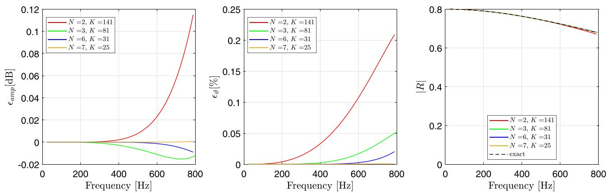  
FIG. 4. (Color online) The dissipation error $\epsilon _ { a m p }$ in dB, the phase error $\epsilon _ { \vartheta }$ in % and the amplitude of the plane-wave reflection coefficient from a single reflection for a single real pole model.

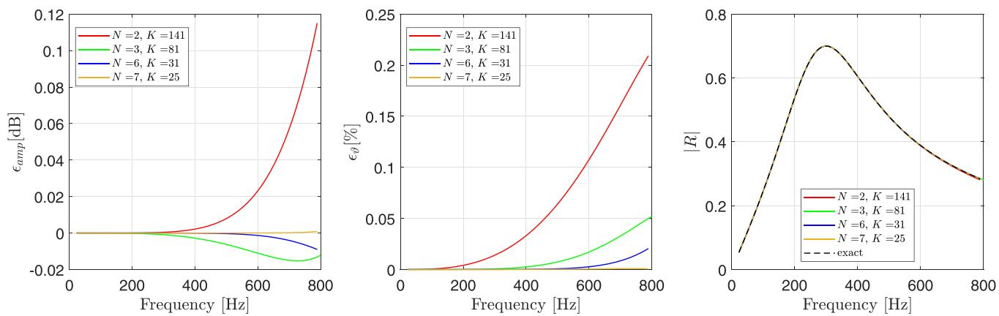  
FIG. 5. (Color online) The dissipation error $\epsilon _ { a m p }$ in dB, the phase error $\epsilon _ { \vartheta }$ in % and the amplitude of the plane-wave reflection coefficient from a single reflection for a single complex conjugate pole model.

To investigate whether the high-order basis function is a good choice for modeling frequency-dependent impedance boundary in terms of the cost efficiency the following measure as a function of basis function order N is used to give a general estimate of the computational cost under a required simulation time44

$$
W _ {c} (N) = N _ {\text {timesteps}} \cdot N _ {D O F}, \tag {32}
$$

where $N _ { t i m e s t e p s }$ is the number of time steps and $N _ { D O F }$ is the total number of DOF. This simplified computational cost measure assumes serial computations and excludes the effects of advanced parallel computing and matrix operations on the computational time. For 1D problems, $N _ { D O F } = \left( N + 1 \right)$ - K (K being the number of elements), and under the explicit time-stepping stability condition as in Eq. (21), the computational cost can be re-written as

$$
W _ {c} (N) = C \cdot K \cdot N ^ {2} \cdot (N + 1) \cdot K, \tag {33}
$$

where the constant factor C is determined by the CFL number and the number of acoustic variables. Now, suppose the computational budget is set by restricting $K \cdot N ^ { 2 } \cdot \left( N + 1 \right) \cdot K$ ${ \approx } 2 . 4 \times 1 0 ^ { 5 }$ , then, for polynomial basis function of order $N = [ 2 , 3 , 6 , 7 ]$ , the number of mesh elements $K = [ 1 4 1 , 8 1$ ; 31;25. Simulations with a practically large time step that corresponds to $C _ { C F L } = 1$ in Eq. (21) are performed for each combined set of the polynomial basis order and mesh.

Figure 4 shows the dissipation error $\epsilon _ { a m p }$ and the phase error $\epsilon _ { \vartheta }$ as defined in Eq. (31), as well as the amplitude of the plane-wave reflection coefficient from a single reflection corresponding to a single real pole model, while Fig. 5 presents the results for a single complex conjugate pole model. It can be seen that the numerical errors using highorder polynomial basis functions such as $N = 6 , 7$ , are much smaller than those with low-order basis functions like $N = 2 ,$ 3, indicating that high-order basis functions achieve a better accuracy under a given computational complexity. In other words, under a given threshold value for dissipation and dispersion error, high-order basis functions use less computational power. However, it should be noted that the cost efficiency benefits of using high-order basis concluded above are based on the simplified measure of the computational cost as in Eq. (32), while in practice, other factors such as the parallel implementations could affect the computational time as well.

To check the memory efficiency of high-order basis functions, similar numerical experiments as described above are performed with the polynomial basis function of order $N = [ 3 , 5 , 7 ]$ and the time step size resulting from $C _ { C F L } = 1$ in Eq. (21). The corresponding number of mesh elements are chosen as $K = [ 6 0 , 4 0 , 3 0 ]$ in order to have almost the same number of DOF, i.e., $N _ { D O F } { = } 2 4 0$ . The dissipation and dispersion error is quantified with respect to the DOF per wavelength (DPW), which is defined $\mathrm { { a s } ^ { 4 } }$

TABLE II. The dissipation error $\epsilon _ { a m p }$ in dB as a function of DPW for various polynomial order $N = [ 3 , 5 , 7 ]$ .

<table><tr><td rowspan="2">DPW</td><td colspan="3">Single real pole</td><td colspan="3">Single complex conjugate pole</td></tr><tr><td>N=3</td><td>N=5</td><td>N=7</td><td>N=3</td><td>N=5</td><td>N=7</td></tr><tr><td>8</td><td> $1.4786 \times 10^0$ </td><td> $1.1201 \times 10^{-1}$ </td><td> $5.4273 \times 10^{-2}$ </td><td> $1.4789 \times 10^0$ </td><td> $1.1199 \times 10^{-1}$ </td><td> $5.4275 \times 10^{-2}$ </td></tr><tr><td>10</td><td> $1.4626 \times 10^{-1}$ </td><td> $1.5818 \times 10^{-2}$ </td><td> $6.7342 \times 10^{-3}$ </td><td> $1.4639 \times 10^{-1}$ </td><td> $1.5808 \times 10^{-2}$ </td><td> $6.7357 \times 10^{-3}$ </td></tr><tr><td>12</td><td> $3.1635 \times 10^{-2}$ </td><td> $1.7270 \times 10^{-3}$ </td><td> $1.4177 \times 10^{-3}$ </td><td> $3.1596 \times 10^{-2}$ </td><td> $1.7212 \times 10^{-3}$ </td><td> $1.4185 \times 10^{-3}$ </td></tr></table>

TABLE III. The phase error $\epsilon _ { \vartheta }$ % as a function of DPW for various polynomial order $N = [ 3 , 5 , 7 ] .$ .

<table><tr><td rowspan="2">DPW</td><td colspan="3">Single real pole</td><td colspan="3">Single complex conjugate pole</td></tr><tr><td>N=3</td><td>N=5</td><td>N=7</td><td>N=3</td><td>N=5</td><td>N=7</td></tr><tr><td>8</td><td> $1.2155 \times 10^0$ </td><td> $4.9461 \times 10^{-1}$ </td><td> $3.5896 \times 10^{-2}$ </td><td> $1.2113 \times 10^0$ </td><td> $4.9467 \times 10^{-1}$ </td><td> $3.5932 \times 10^{-2}$ </td></tr><tr><td>10</td><td> $9.2882 \times 10^{-1}$ </td><td> $1.6612 \times 10^{-1}$ </td><td> $1.6333 \times 10^{-2}$ </td><td> $9.2877 \times 10^{-1}$ </td><td> $1.6613 \times 10^{-2}$ </td><td> $1.6323 \times 10^{-2}$ </td></tr><tr><td>12</td><td> $5.4287 \times 10^{-2}$ </td><td> $7.1990 \times 10^{-2}$ </td><td> $7.4670 \times 10^{-3}$ </td><td> $5.4289 \times 10^{-1}$ </td><td> $7.1992 \times 10^{-2}$ </td><td> $7.4616 \times 10^{-3}$ </td></tr></table>

$$
\mathrm{DPW} = \frac {c}{f} \cdot \left(\frac {N _ {p} \cdot K}{V}\right) ^ {1 / d}. \tag {34}
$$

Here, f is the frequency of interest, $N _ { p } = N + 1$ is the number of points inside single 1D element, d is the physical dimension, and V is the volume of the whole domain. For the considered 1D test, $D P W \approx [ 8 , 1 0 , 1 2 ]$ when $f \approx [ 1 0 0 0 $ 800; 680 Hz. Table II shows the dissipation error $\epsilon _ { a m p }$ for both the single real pole case and the single complex conjugate pole case, while the results of the phase error $\epsilon _ { \vartheta }$ are displayed in Table III. Almost the same error magnitudes are obtained for both types of poles. Furthermore, it can be observed that given the same spatial resolution, high-order basis functions achieve better accuracy compared to loworder basis functions.

## B. 3D single reflection from an impedance surface modeled by JCAL

To verify the impedance boundary condition formulation in 3D, a large 3D domain with a reflecting impedance boundary on the bottom is now considered. The impedance of the reflecting boundary is the surface impedance of the rigidly backed glass-wool panel as in Eq. (26). This test case mimics the reflection scenarios that happen multiple times in a real room acoustic simulation. The Gaussian pressure pulse is centered at $\pmb { x } _ { s } = [ 0 , 0 , 0 ]$ m, a plane reflecting surface is placed 2 m away from the source at $z = - 2$ m and two receivers are placed at $\pmb { x } _ { r 1 } = [ 0 , 0 , - 1 ]$ m and $\begin{array} { r } { \pmb { x } _ { r 2 } = [ 4 , 4 , - 1 ] } \end{array}$ m, which corresponds to the normal incidence and the oblique incidence with an incidence angle of $6 3 ^ { \circ }$ , respectively. The value of b as in Eq. (29) is chosen as 0.17 so that the pulse has a significant frequency content up to 700 Hz. In this work, the hard wall boundary conditions are imposed on exterior boundaries of the whole computational domain, and the simulations are stopped as soon as the pulse has passed the receivers’ location to a sufficient extent, but before the reflected waves from the exterior boundaries reach the receivers. For the normal incidence case, Fig. 6 shows the configuration diagram to obtain the reflected sound at the first receiver $x _ { r 1 }$ with a reflecting surface on the bottom. For the oblique incidence case, a cubic domain of dimension $[ - 5 . 5 , 9 . 5 ] \times [ - 5 . 5 , 9 . 5 ] \times [ - 2 , 7 . 5 ]$ in meters is used to obtain the reflected sound at $x _ { r 2 }$ . The simulations are run for a non-dimensional time of $\bar { t } = t / ( l _ { r e f } / c ) = 1 0$ . Uniform structured tetrahedra meshes generated with the meshing software $\mathrm { G M S H } ^ { 5 0 }$ are used for this study. In order to have sufficient spatial resolution at the highest frequency of interest 700 Hz, the mesh size is chosen as 0.5 m and simulations with polynomial basis of order $N = [ 7 , 9 ]$ are performed, resulting in DPW of ½8:8; 10:8. The time step sizes used correspond to $C _ { C F L } = 1$ as in Eq. (21).

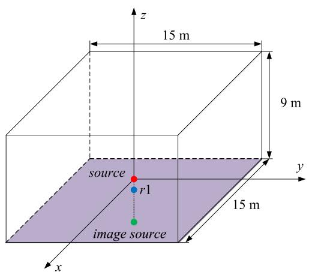

text_image

z
15 m
9 m
source
r1
y
15 m
image source
x

FIG. 6. (Color online) 3D computational domain to obtain reflected sound at normal incidence.

The analytical solutions of the total pressure, which includes both the direct sound and the reflected sound, for the considered test case exist in the frequency domain.51 For the Gaussian pulse as described in Eq. (29), the direct sound reaching the receivers can be calculated analytically as $p _ { d , a n a } ( t ) = [ ( r _ { s r } - c t ) / 2 r _ { s r } ] \mathrm { e } ^ { ( - \ln { 2 / b ^ { 2 } } ) ( r _ { s r } - c t ) ^ { 2 } } + [ ( r _ { s r } + c t ) / 2 r _ { s r } ]$ $\mathrm { e } ^ { ( - \ln 2 / \dot { b } ^ { 2 } ) ( r _ { s r } + c t ) ^ { 2 } }$ (with $r _ { s r }$ being the source-receiver distance).4 Figure 7 shows the comparison of the simulated pressure and the analytical solutions for both cases in terms of the amplitude and the phase. A good match between these results is observed, demonstrating the correct implementation and high precision of the proposed boundary scheme.

However, the comparison of the pressure field alone hardly reveals detailed information regarding the error behaviour. To investigate that, the error measures of Eq. (31) defined in the 1D tests are considered. The analytical spherical-wave reflection coefficient ${ R _ { a n a } } ^ { 5 2 }$ corresponding to the rigidly backed glass-wool as in Eq. (26) and the numerical reflection coefficient $R _ { n u m }$ is calculated as shown in

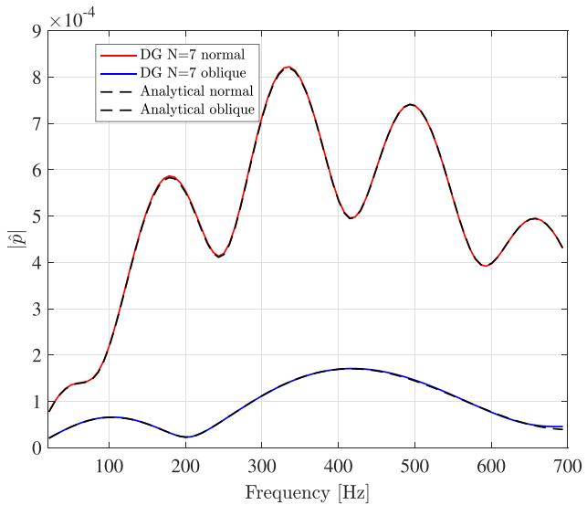

line

| Frequency [Hz] | DG N=7 normal (x 10^-4) | DG N=7 oblique (x 10^-4) |
| --- | --- | --- |
| 0 | ~0.8 | ~0.2 |
| 100 | ~1.5 | ~0.6 |
| 200 | ~5.8 | ~0.3 |
| 300 | ~4.2 | ~0.9 |
| 400 | ~8.2 | ~1.7 |
| 500 | ~5.0 | ~1.5 |
| 600 | ~7.4 | ~1.1 |
| 700 | ~4.3 | ~0.4 |

(a)

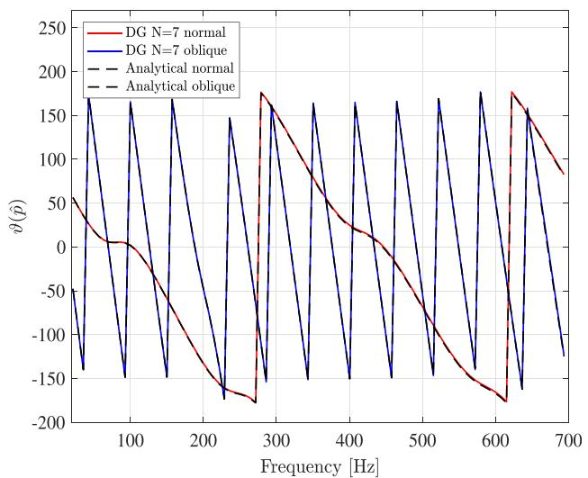

line

| Frequency [Hz] | DG N=7 normal | DG N=7 oblique | Analytical normal | Analytical oblique |
| --- | --- | --- | --- | --- |
| 0 | ~55 | ~-45 | ~55 | ~-45 |
| 100 | ~5 | ~165 | ~5 | ~165 |
| 200 | ~-130 | ~-130 | ~-130 | ~-130 |
| 300 | ~175 | ~175 | ~175 | ~175 |
| 400 | ~25 | ~-150 | ~25 | ~-150 |
| 500 | ~-80 | ~-145 | ~-80 | ~-145 |
| 600 | ~-175 | ~-160 | ~-175 | ~-160 |
| 700 | ~85 | ~-125 | ~85 | ~-125 |

(b)  
FIG. 7. (Color online) Complex pressure of a single reflection from a locally reacting, frequency dependent impedance boundary, compared with the analytic solution. (a) Amplitude. (b) Phase in degree.

Ref. 4. It should be noted that the observed numerical errors could arise from several potential mechanisms, including the dissipation and dispersion during the wave propagation, the reflection from the impedance boundary. In particular, early truncation of the recorded time signal has a large effect on the low frequency error. In order to focus on the error arising from the boundary condition alone and to rule out the effects of other mechanisms, the well-established hard wall boundary condition31,53 and its associated error is used as a reference bound for the reflecting surface. Its implementation has been verified in previous work4 by comparison against the analytical solution for a 3D cuboid room with rigid walls. Figure 8 shows the results of both the normal incidence and the oblique incidence cases. It is observed that the error behaviour of the proposed impedance boundary condition more or less follows the hard wall case. The small deviation can be partly attributed to the approximation error of the JCAL model using the multi-pole models. Furthermore, reduction of error in the high frequency range with a higher polynomial order illustrates the convergence.

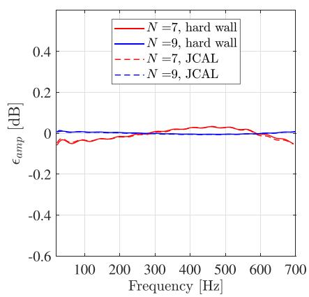

line

| Frequency [Hz] | N=7, hard wall (dB) | N=9, hard wall (dB) | N=7, JCAL (dB) | N=9, JCAL (dB) |
| --- | --- | --- | --- | --- |
| 50 | ~-0.05 | ~0.01 | ~-0.02 | ~0.01 |
| 100 | ~-0.04 | ~0.01 | ~-0.03 | ~0.01 |
| 200 | ~-0.03 | ~0.01 | ~-0.02 | ~0.01 |
| 300 | ~0.01 | ~0.01 | ~0.01 | ~0.01 |
| 400 | ~0.03 | ~0.01 | ~0.02 | ~0.01 |
| 500 | ~0.03 | ~0.01 | ~0.02 | ~0.01 |
| 600 | ~0.01 | ~0.01 | ~-0.01 | ~0.01 |
| 700 | ~-0.05 | ~0.01 | ~-0.04 | ~0.01 |

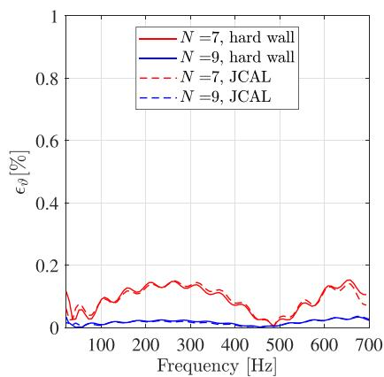

line

| Frequency [Hz] | N=7, hard wall (%) | N=9, hard wall (%) | N=7, JCAL (%) | N=9, JCAL (%) |
| --- | --- | --- | --- | --- |
| 0 | ~0.12 | ~0.01 | ~0.12 | ~0.01 |
| 50 | ~0.03 | ~0.01 | ~0.04 | ~0.01 |
| 100 | ~0.08 | ~0.02 | ~0.08 | ~0.02 |
| 150 | ~0.12 | ~0.02 | ~0.12 | ~0.02 |
| 200 | ~0.14 | ~0.03 | ~0.14 | ~0.03 |
| 250 | ~0.14 | ~0.03 | ~0.14 | ~0.03 |
| 300 | ~0.14 | ~0.03 | ~0.14 | ~0.03 |
| 350 | ~0.12 | ~0.02 | ~0.12 | ~0.02 |
| 400 | ~0.08 | ~0.02 | ~0.08 | ~0.02 |
| 450 | ~0.03 | ~0.01 | ~0.03 | ~0.01 |
| 500 | ~0.03 | ~0.01 | ~0.03 | ~0.01 |
| 550 | ~0.08 | ~0.02 | ~0.08 | ~0.02 |
| 600 | ~0.12 | ~0.03 | ~0.12 | ~0.03 |
| 650 | ~0.14 | ~0.03 | ~0.14 | ~0.03 |
| 700 | ~0.11 | ~0.03 | ~0.11 | ~0.03 |

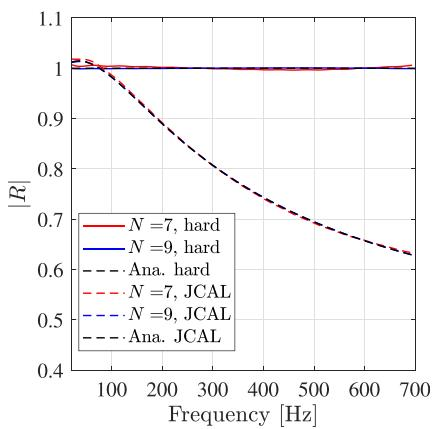

line

| Frequency [Hz] | N=7, hard | N=9, hard | Ana. hard | N=7, JCAL | N=9, JCAL | Ana. JCAL |
| --- | --- | --- | --- | --- | --- | --- |
| 50 | ~1.02 | ~1.00 | ~1.02 | ~1.02 | ~1.02 | ~1.02 |
| 100 | ~1.01 | ~1.00 | ~0.98 | ~1.01 | ~1.01 | ~0.98 |
| 200 | ~1.00 | ~1.00 | ~0.88 | ~1.00 | ~1.00 | ~0.88 |
| 300 | ~1.00 | ~1.00 | ~0.81 | ~1.00 | ~1.00 | ~0.81 |
| 400 | ~1.00 | ~1.00 | ~0.74 | ~1.00 | ~1.00 | ~0.74 |
| 500 | ~1.00 | ~1.00 | ~0.69 | ~1.00 | ~1.00 | ~0.69 |
| 600 | ~1.00 | ~1.00 | ~0.66 | ~1.00 | ~1.00 | ~0.66 |
| 700 | ~1.01 | ~1.00 | ~0.63 | ~1.01 | ~1.01 | ~0.63 |

(a)

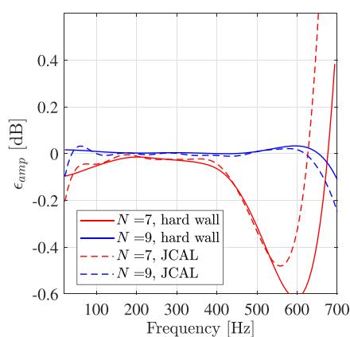

line

| Frequency [Hz] | N=7, hard wall | N=9, hard wall | N=7, JCAL | N=9, JCAL |
| --- | --- | --- | --- | --- |
| 0 | ~-0.1 | ~0.02 | ~-0.2 | ~-0.1 |
| 100 | ~-0.05 | ~0.01 | ~-0.05 | ~0.03 |
| 200 | ~-0.01 | ~0.01 | ~-0.01 | ~0.01 |
| 300 | ~-0.02 | ~0.01 | ~-0.02 | ~0.01 |
| 400 | ~-0.05 | ~0.01 | ~-0.05 | ~0.01 |
| 500 | ~-0.25 | ~0.02 | ~-0.25 | ~0.02 |
| 600 | ~-0.6 | ~0.03 | ~-0.48 | ~0.03 |
| 700 | ~0.4 | ~-0.1 | >0.5 | ~-0.2 |

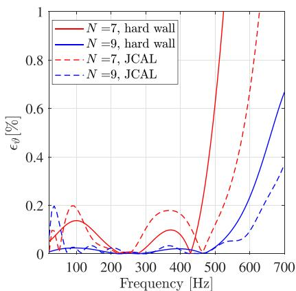

line

| Frequency [Hz] | N=7, hard wall (%) | N=9, hard wall (%) | N=7, JCAL (%) | N=9, JCAL (%) |
| --- | --- | --- | --- | --- |
| 0 | ~0.05 | ~0.01 | ~0.08 | ~0.20 |
| 100 | ~0.14 | ~0.03 | ~0.20 | ~0.02 |
| 200 | ~0.02 | ~0.01 | ~0.02 | ~0.01 |
| 300 | ~0.01 | ~0.01 | ~0.12 | ~0.01 |
| 400 | ~0.10 | ~0.03 | ~0.18 | ~0.03 |
| 500 | ~0.65 | ~0.05 | ~0.25 | ~0.05 |
| 600 | >1.0 | ~0.25 | ~0.65 | ~0.15 |
| 700 | >1.0 | ~0.67 | >1.0 | ~0.36 |

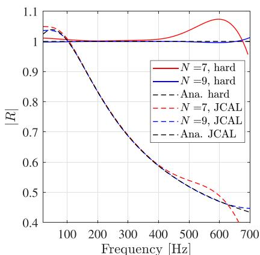

line

| Frequency (Hz) | N=7, hard | N=9, hard | Ana. hard | N=7, JCAL | N=9, JCAL | Ana. JCAL |
| --- | --- | --- | --- | --- | --- | --- |
| 50 | ~1.01 | 1.00 | ~1.03 | ~1.05 | ~1.04 | ~1.04 |
| 100 | ~1.01 | 1.00 | ~1.02 | ~1.02 | ~1.02 | ~1.02 |
| 200 | ~1.01 | 1.00 | ~0.85 | ~0.85 | ~0.85 | ~0.85 |
| 300 | ~1.01 | 1.00 | ~0.68 | ~0.68 | ~0.68 | ~0.68 |
| 400 | ~1.02 | 1.00 | ~0.58 | ~0.58 | ~0.58 | ~0.58 |
| 500 | ~1.04 | 1.00 | ~0.52 | ~0.53 | ~0.52 | ~0.52 |
| 600 | ~1.07 | 1.00 | ~0.47 | ~0.49 | ~0.47 | ~0.47 |
| 700 | ~0.96 | 1.01 | ~0.44 | — | ~0.44 | — |

FIG. 8. (Color online) The dissipation error $\epsilon _ { a m p } ,$ the phase error $\epsilon _ { \vartheta }$ in and the amplitude of the spherical-wave reflection coefficient for the rigidly backed JCAL layer and the rigid wall. (a) Normal incidence. (b) Oblique incidence.

## IV. CONCLUSIONS

In this work, a numerical formulation for the TDIBC implementations in the framework of the TD-DG method is developed for the simulation of broadband sound propagation problems, specially targeting at the room acoustic applications. The essential idea is to model the acoustic reflection behaviour of a locally-reacting surface using the reflection coefficient RðxÞ in the form of a multi-pole model and then reformulate the corresponding time-domain upwind flux. This work is an extension of previous frequencyindependent impedance boundary formulation to a generic broadband one. The properties of the multi-pole model are discussed, followed by a straightforward and effective parameter identification strategy to ensure the fully-discrete stability of the whole formulation. An application example of a typical impedance boundary of a rigidly-backed glasswool baffle for room acoustic purposes is presented.

To verify the performance of the formulation, the reflection coefficients obtained from numerical tests are compared with the analytical ones. The 1D tests verify the high-order convergence property of the proposed formulation for accurately representing the reflection behavior of the plane wave. Meanwhile, the benefits of using high-order polynomial basis functions are demonstrated through the single reflection scenario, indicating a significant improvement in both cost efficiency and memory efficiency. The 3D tests further demonstrate the capacity of the proposed methodology for representing practical locally-reacting impedance boundary in the multi-dimensional case. To sum up, the proposed method further strengthens the potential of the TD-DG method as a wave-based method for room acoustics modeling.

## ACKNOWLEDGMENTS

This project has received funding from the European Union’s Horizon 2020 research and innovation programme under Grant No. 721536. Additionally, we would like to thank Mr. Finnur Pind from the Department of Electrical Engineering at Technical University of Denmark for his kind help with the analytical solution of the 3D reflecting surface test case. Last but not least, the constructive comments and suggestions from the anonymous reviewers are greatly appreciated.

## APPENDIX

TABLE IV. Overview of the JCAL impedance model.

<table><tr><td>Property</td><td>Value</td></tr><tr><td>Atmospheric pressure  $P_0$  (Pa)</td><td> $1.01 \times 10^5$ </td></tr><tr><td>Speed of sound  $c$  (m · s $^{-1}$ )</td><td>343</td></tr><tr><td>Density  $\rho$  (kg · m $^{-3}$ )</td><td>1.2</td></tr><tr><td>Airflow resistivity  $\sigma$  (Pa · s · m $^{-2}$ )</td><td>70821</td></tr><tr><td>Porosity  $\varphi$ </td><td>0.967</td></tr><tr><td>Tortuosity  $\alpha_\infty$ </td><td>1.049</td></tr><tr><td>Viscous characteristic length  $\Lambda$  (m)</td><td> $6 \times 10^{-5}$ </td></tr><tr><td>Thermal characteristic length  $\Lambda'$  (m)</td><td> $1.4 \times 10^{-4}$ </td></tr><tr><td>Static thermal permeability  $k'_0$  (m $^2$ )</td><td> $6.345 \times 10^{-9}$ </td></tr><tr><td>Dynamic viscosity  $\eta$  (N · m $^{-2}$ )</td><td> $1.82 \times 10^{-5}$ </td></tr><tr><td>Prandtl number  $P_r$ </td><td>0.71</td></tr><tr><td>Layer thickness  $d$  (m)</td><td>0.04</td></tr><tr><td>Specific heat ratio  $\gamma$ </td><td>1.4</td></tr></table>

1 H. Kuttruff, Room Acoustics (CRC Press, Boca Raton, FL, 2016).  
2 T. Sakuma, S. Sakamoto, and T. Otsuru, Computational Simulation in Architectural and Environmental Acoustics (Springer, New York, 2014).  
3 I. Toulopoulos and J. A. Ekaterinaris, “High-order discontinuous galerkin discretizations for computational aeroacoustics in complex domains,” AIAA J. 44(3), 502–511 (2006).  
4 H. Wang, I. Sihar, R. Pag-an Mu\~noz, and M. Hornikx, “Room acoustics modelling in the time-domain with the nodal discontinuous galerkin method,” J. Acoust. Soc. Am. 145(4), 2650–2663 (2019).  
5 A. Modave, A. St-Cyr, and T. Warburton, “GPU performance analysis of a nodal discontinuous Galerkin method for acoustic and elastic models,” Comput. Geosci. 91, 64–76 (2016).  
6 S. Schoeder, W. Wall, and M. Kronbichler, “Exwave: A high performance discontinuous galerkin solver for the acoustic wave equation,” SoftwareX 9, 49–54 (2019).  
7 S. M. Schoeder, “Efficient discontinuous Galerkin methods for wave propagation and iterative optoacoustic image reconstruction,” Ph.D. thesis, Technische Universit€at M€unchen, M€unchen, Germany, 2019.  
8 S. Bilbao, “Modeling of complex geometries and boundary conditions in finite difference/finite volume time domain room acoustics simulation,” IEEE Trans. Audio Speech Lang. Process. 21(7), 1524–1533 (2013).  
9 S. Rienstra, “Impedance models in time domain, including the extended helmholtz resonator model,” in Proceedings of the 12th AIAA/CEAS Aeroacoustics Conference (27th AIAA Aeroacoustics Conference), Cambridge, MA (May 8–10, 2006), p. 2686.  
10Y. Reymen, M. Baelmans, and W. Desmet, “Efficient implementation of Tam and Auriault’s time-domain impedance boundary condition,” AIAA J. 46(9), 2368–2376 (2008).  
11S. Bilbao, B. Hamilton, J. Botts, and L. Savioja, “Finite volume time domain room acoustics simulation under general impedance boundary conditions,” IEEE/ACM Trans. Audio Speech Lang. Process. (TASLP) 24(1), 161–173 (2016).  
12S. Zhong, X. Zhang, and X. Huang, “A controllable canonical form implementation of time domain impedance boundary conditions for broadband aeroacoustic computation,” J. Comput. Phys. 313, 713–725 (2016).  
13K.-Y. Fung and H. Ju, “Broadband time-domain impedance models,” AIAA J. 39(8), 1449–1454 (2001).  
14H. Ju and K.-Y. Fung, “Time-domain simulation of acoustic sources over an impedance plane,” J. Comput. Acoust. 10(03), 311–329 (2002).  
15K.-Y. Fung and H. Ju, “Time-domain impedance boundary conditions for computational acoustics and aeroacoustics,” Int. J. Comput. Fluid Dyn. 18(6), 503–511 (2004).  
16Q. Douasbin, C. Scalo, L. Selle, and T. Poinsot, “Delayed-time domain impedance boundary conditions (d-tdibc),” J. Comput. Phys. 371, 50–66 (2018).  
17D. Dragna and P. Blanc-Benon, “Physically admissible impedance models for time-domain computations of outdoor sound propagation,” Acta Acust. united Ac. 100(3), 113 (2014).  
18D. Dragna, K. Attenborough, and P. Blanc-Benon, “On the inadvisability of using single parameter impedance models for representing the acoustical properties of ground surfaces,” J. Acoust. Soc. Am. 138(4), 2399–2413 (2015).  
19D. Botteldooren, “Finite-difference time–domain simulation of low–frequency room acoustic problems,” J. Acoust. Soc. Am. 98(6), 3302–3308 (1995).  
20C. K. Tam and L. Auriault, “Time-domain impedance boundary conditions for computational aeroacoustics,” AIAA J. 34(5), 917–923 (1996).  
21K. Kowalczyk and M. van Walstijn, “Formulation of locally reacting surfaces in FDTD/K-DWM modelling of acoustic spaces,” Acta Acust. united Ac. 94(6), 891–906 (2008).  
22S. Sakamoto, H. Nagatomo, A. Ushiyama, and H. Tachibana, “Calculation of impulse responses and acoustic parameters in a hall by the finite-difference time-domain method,” Acoust. Sci. Technol. 29(4), 256–265 (2008).  
23K. Kowalczyk and M. V. Walstijn, “Modeling frequency-dependent boundaries as digital impedance filters in FDTD and K-DWM room acoustics simulations,” J. Audio Eng. Soc. 56(7/8), 569–583 (2008).  
24J. Escolano, F. Jacobsen, and J. J. L-opez, “An efficient realization of frequency dependent boundary conditions in an acoustic finite-difference time-domain model,” J. Sound Vib. 316(1–5), 234–247 (2008).  
25B. Cott-e, P. Blanc-Benon, C. Bogey, and F. Poisson, “Time-domain impedance boundary conditions for simulations of outdoor sound propagation,” AIAA J. 47(10), 2391–2403 (2009).  
26D. Dragna, B. Cott-e, P. Blanc-Benon, and F. Poisson, “Time-domain simulations of outdoor sound propagation with suitable impedance boundary conditions,” AIAA J. 49(7), 1420–1428 (2011).  
27D. Dragna, P. Blanc-Benon, and F. Poisson, “Time-domain solver in curvilinear coordinates for outdoor sound propagation over complex terrain,” J. Acoust. Soc. Am. 133(6), 3751–3763 (2013).  
28R. Troian, D. Dragna, C. Bailly, and M.-A. Galland, “Broadband liner impedance eduction for multimodal acoustic propagation in the presence of a mean flow,” J. Sound Vib. 392, 200–216 (2017).  
29S. Bilbao and B. Hamilton, “Passive volumetric time domain simulation for room acoustics applications,” J. Acoust. Soc. Am. 145(4), 2613–2624 (2019).  
30F. Monteghetti, D. Matignon, and E. Piot, “Energy analysis and discretization of nonlinear impedance boundary conditions for the time-domain linearized Euler equations,” J. Comput. Phys. 375, 393–426 (2018).  
31J. S. Hesthaven and T. Warburton, Nodal Discontinuous Galerkin Methods: Algorithms, Analysis and Applications (Springer-Verlag, New York, 2007).  
32F. Q. Hu, M. Hussaini, and P. Rasetarinera, “An analysis of the discontinuous Galerkin method for wave propagation problems,” J. Comput. Phys. 151(2), 921–946 (1999).  
33F. Hu and H. Atkins, “Two-dimensional wave analysis of the discontinuous Galerkin method with non-uniform grids and boundary conditions,” in Proceedings of the 8th AIAA/CEAS Aeroacoustics Conference & Exhibit, Breckenridge, CO (June 17–20, 2002), p. 2514.  
34J. Saarelma, J. Botts, B. Hamilton, and L. Savioja, “Audibility of dispersion error in room acoustic finite-difference time-domain simulation as a function of simulation distance,” J. Acoust. Soc. Am. 139(4), 1822–1832 (2016).  
35J. S. Hesthaven and C.-H. Teng, “Stable spectral methods on tetrahedral elements,” SIAM J. Sci. Comput. 21(6), 2352–2380 (2000).  
36M. Ainsworth, “Dispersive and dissipative behaviour of high order discontinuous Galerkin finite element methods,” J. Comput. Phys. 198(1), 106–130 (2004).  
37P. Lasaint and P.-A. Raviart, “On a finite element method for solving the neutron transport equation,” in Mathematical Aspects of Finite Elements in Partial Differential Equations (Elsevier, Amsterdam, the Netherlands, 1974), pp. 89–123.  
38K. Gunnarsd-ottir, C.-H. Jeong, and G. Marbjerg, “Acoustic behavior of porous ceiling absorbers based on local and extended reaction,” J. Acoust. Soc. Am. 137(1), 509–512 (2015).  
39D. Dragna, P. Pineau, and P. Blanc-Benon, “A generalized recursive convolution method for time-domain propagation in porous media,” J. Acoust. Soc. Am. 138(2), 1030–1042 (2015).  
40R. M. Joseph, S. C. Hagness, and A. Taflove, “Direct time integration of maxwell’s equations in linear dispersive media with absorption for scattering and propagation of femtosecond electromagnetic pulses,” Opt. Lett. 16(18), 1412–1414 (1991).  
41M. H. Carpenter and C. A. Kennedy, “Fourth-order 2N-storage Runge-Kutta schemes,” Report No. NASA-TM-109112 (NASA, Washington, DC, 1994).  
42S. C. Reddy and L. N. Trefethen, “Stability of the method of lines,” Numer. Math. 62(1), 235–267 (1992).  
43B. Gustafsson, High Order Difference Methods for Time Dependent PDE (Springer-Verlag, Berlin, Germany, 2007).  
44F. Pind, A. P. Engsig-Karup, C.-H. Jeong, J. S. Hesthaven, M. S. Mejling, and J. Strømann-Andersen, “Time domain room acoustic simulations using the spectral element method,” J. Acoust. Soc. Am. 145(6), 3299–3310 (2019).  
45D. Lafarge, P. Lemarinier, J. F. Allard, and V. Tarnow, “Dynamic compressibility of air in porous structures at audible frequencies,” J. Acoust. Soc. Am. 102(4), 1995–2006 (1997).  
46N. Hoeskstra, “Sound absorption of periodically spaced baffles,” M.S. thesis, Eindhoven University of Techonology, Eindhoven, the Netherlands, 2016.  
47R. H. Byrd, M. E. Hribar, and J. Nocedal, “An interior point algorithm for large-scale nonlinear programming,” SIAM J. Optim. 9(4), 877–900 (1999).  
48Mathworks Inc., MATLAB Optimization Toolbox (R2018b) (The MathWorks, Inc., Natick, MA 2018).  
49Y. Ozy € €or€uk and L. N. Long, “A time-domain implementation of surface acoustic impedance condition with and without flow,” J. Comput. Acoust. 5(03), 277–296 (1997).  
50C. Geuzaine and J.-F. Remacle, “Gmsh: A 3-D finite element mesh generator with built-in pre- and post-processing facilities,” Int. J. Numer. Methods Eng. 79(11), 1309–1331 (2009).  
51K. W. Thompson, “Time dependent boundary conditions for hyperbolic systems,” J. Comput. Phys. 68(1), 1–24 (1987).  
52X. Di and K. E. Gilbert, “An exact Laplace transform formulation for a point source above a ground surface,” J. Acoust. Soc. Am. 93(2), 714–720 (1993).  
53H. Atkins, “Continued development of the discontinuous Galerkin method for computational aeroacoustic applications,” in Proceedings of the 3rd AIAA/CEAS Aeroacoustics Conference, Atlanta, GA (May 12–14, 1997), p. 1581.